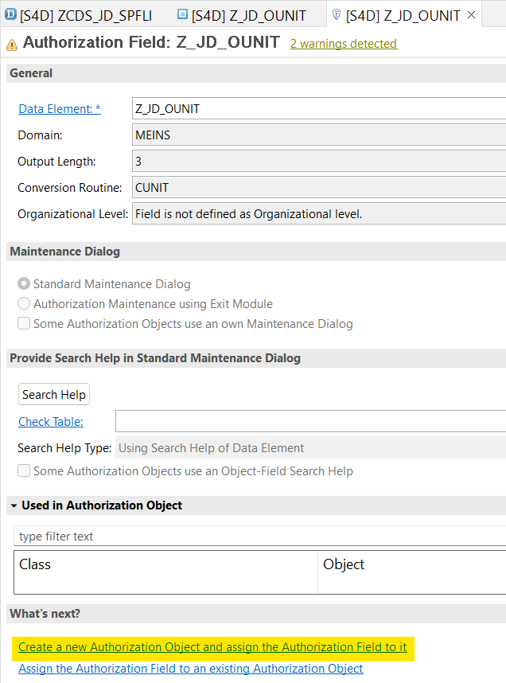
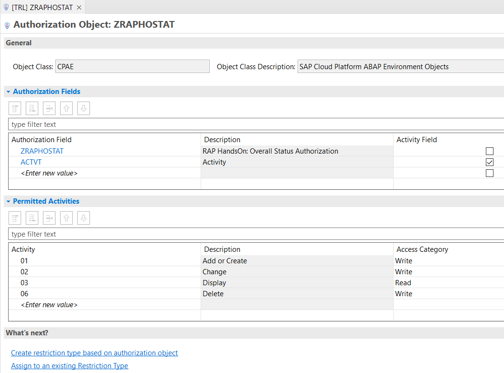

# Implementing Basic Authorizations 
## Table of Contents
* **Implementing Basic Authorizations**  
    * [Introduction](#markdown-header-introduction)  
    * [Creating the Data Element](#markdown-header-creating-the-data-element)  
    * [Creating the Authorization Field & Object](#markdown-header-creating-the-authorization-field-object)  
    * [Creating a CDS Access Control](#markdown-header-creating-a-cds-access-control)  
    * [Inheriting the CDS Access Control](#markdown-header-inheriting-the-cds-access-control)  


## Introduction
[^ Top of page](#)  
In this chapter we will introduce some basic authorizations to our scenario. Not every user might be allowed to view or do everything in a production environment. Therefore, we'll restrict the shown data based on the `DistanceUnit`. We need an autorization object, authorization field and data element for this and will use the Data Control Language to restrict the data for the CDS Views.

### Creating the Data Element
[^ Top of page](#)  
Right-click your ABAP Project in Eclipse and create a new data element named `Z_##_OUNIT` with a meaningful description like e.g. *CDS Demo: Distance Unit Authorization*. Select the Domain *Type Name* `MEINS`, provide field labels and activate the data element.

### Creating the Authorization Field & Object
[^ Top of page](#)  
Next, we'll create an *Authorization Field* with the name `Z_##_OUNIT` (sadly, authorization field names have a maximum of only 10 characters). After executing the *New...* wizard on your package provide the previously created data element `Z_##_OUNIT` for the authorization field and save it.

With the authorization field being shown in the Eclipse editor, click on *Create a new Authorization Object and assign the Authorization Field to it*.



In this wizard, again provide `Z_##_OUNIT` as name for you authorization object and choose a meaningful description before finishing. The authorization field table should automatically include your field `Z_##_OUNIT` as well as `ACTVT`. Add the following values to the *Permitted Activities* (if they're not already pre-filled):
* `01` Add or Create
* `02` Change
* `03` Display
* `06` Delete

Now you can save and activate the authorization object, it should look like this:



### Creating a CDS Access Control
[^ Top of page](#)  
**Using a literal condition**  
Now we want to actually use the created authorization object! To do so we have to define an *Access Control* for our travel interface view using ABAP's data control language. To do so, right-click your CDS view `ZCDS_##_SPFLI` and select *New Access Control*. The name should be the same as the view itself and you can choose a fitting description for the Access Control. When continuing the wizard using *Next >* you'll get to the template selection - choose *Define Role with Simple Conditions* and *Finish*.

In the template, replace the `where` condition to restrict access to flights with `DistanceUnit = 'KM';` and activate the Access Control afterwards. Now you can try to execute the data preview for the CDS view and will only see entries with kilometres as distance.

**Using a PFCG condition**  
Next, we'll improve our Access Control to become more sophisticated and actually use the authorization object and field. This will require a `aspect pfcg_auth` condition - PFCG means the profiles generated in SAP systems based on user roles. First, delete the existing where condition in the Access Control and replace it with the following code:
```abap
  ( DistanceUnit )                       
    = aspect pfcg_auth ( Z_##_OUNIT, Z_##_OUNIT, actvt = '03' ) 
      and
      DistanceUnit = 'KM'; 
```

Activate the updated access control and run the CDS View Data Preview again. This time you won't see any results at all (because your user doesn't have the necessary PFCG role containing the authorization object + field). Depending on your system you might be able to grant the necessary rights to your user.

### Inheriting the CDS Access Control
[^ Top of page](#)  
Note: If you're using your CDS view in a Fiori app, it is necessary for the consumption view to inherit the access rules from its underlying CDS View. Otherwise, they won't have an effect on those CDS views selecting from your current one.  