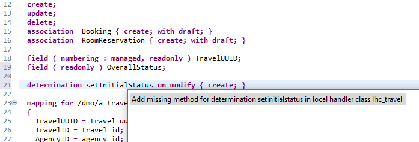

# Part 4c - Behavior Implementation

## Implementing the business object behavior

### Introduction
For the implementation of the business object behavior the RESTful Programming model has introduced the concept of behavior pools. One Behavior Definition can be implemented with a single or more of such special ABAP classes (e.g. one separate class per instance). The actual implementation is then defined within local classes in this behavior pool with itself just serving as basically empty container with the following syntax:
```abap
CLASS class_name DEFINITION PUBLIC ABSTRACT FINAL FOR BEHAVIOR OF MyRootBehavior.
ENDCLASS.
				
CLASS class_name IMPLEMENTATION.
ENDCLASS.
```
Nontheless, common or public aspects of the implementation may be defined in static methods if necessary (CLASS-DATA, CONSTANTS, TYPES). A common scenario is one behavior pool per business object node (in our case Travel, Booking, BookingSupplement and RoomReservation), but this is not mandatory. But it is a good practice to additionally define at least one separate auxiliary class for helper methods (like message handling). 

### Enhance the behavior definition
- Open the base behavior definition `ZRAPH_##_I_TravelWDTP`
- Provide the behavior implementation for each entity in a separate ABAP class.
For that, specify a behavior implementation class (aka behavior pool) using a definition like e.g. `implementation in class zraph_##_bp_i_travelwdtp unique` for each entity directly under the `define behavior for ...` statement.

>**Remark** The ADT `Quick Fix` feature can be used to generate the class, do this for each entity class. For this, set the cursor on the class name, and press `Ctrl + 1` to start the Quick Fix dialog.      
Open the created class and click `Local Type` on the bottom - here we should have the local class. This is where we implement the logic for all validations, actions, determinations and feature control. Make sure the framework is also generating the `get_features` method, otherwise we would have errors.  
Every time we add a new action, determination or validation use the quick fix in the behavior definition to adjust the associated behavior pool class with a new method.



**Solution**
- [ZRAPH_##_I_TravelWDTP](sources/Z_I_TravelWDTP_v3.txt) with draft.


### Creating Behavior Pool 

#### Actions
Actions are used to manifest business logic specific workflows in one operation. You can implement simple status changes or a complete creation workflow in one operation. For the UI, you can define action buttons that execute the action directly when the consumer chooses the button. For more detailed information, see [Actions](https://help.sap.com/viewer/fc4c71aa50014fd1b43721701471913d/202009.000/en-US/83bad707a5a241a2ae93953d81d17a6b.html).

```abap
define behavior for ZRAPH_##_I_TravelWDTP alias Travel
...
{
...
  action <action_name> result [1] $self;
  internal action <action_name>;
...
}
```

**1. Travel**  

- Action `acceptTravel` and `rejectTravel`.
The `acceptTravel` action sets the status to Accepted (A), and `rejectTravel` to Rejected (X).  
Technically speaking, both actions are instance actions with return parameter $self. The value of the field OverallStatus is changed by executing a modify request to update this field the corresponding value.  
For implementation you have to go to your Behavior Pool of the travel instance and add the methods under Local Types using Quick Fix. In the method implementation you'll want to use the EML Update syntax to set the status to either accepted or rejected. For more information on EML, check the course slides or visit [SAP Help for EML](https://help.sap.com/viewer/923180ddb98240829d935862025004d6/Cloud/en-US/af7782de6b9140e29a24eae607bf4138.html).  
```abap
MODIFY ENTITIES OF zraph_##_i_travelwdtp IN LOCAL MODE  
  ENTITY travel
    UPDATE FIELDS ( overallstatus )
    WITH VALUE #( FOR key IN keys ( %tky          = key-%tky
                                    overallstatus = 'A' ) )
```
Afterwards you'll have to return the modified instances to update them on the application.
```abap
READ ENTITIES OF zraph_##_i_travelwdtp IN LOCAL MODE
     ENTITY travel
      ALL FIELDS WITH
      CORRESPONDING #( keys )
    RESULT DATA(travels).

  result = VALUE #( FOR travel IN travels ( %tky   = travel-%tky
                                              %param = travel ) ).
```
**Solutions**  
[ZRAPH_##_BP_I_TRAVELWDTP~AcceptTravel](sources/AcceptTravel.txt)  
[ZRAPH_##_BP_I_TRAVELWDTP~RejectTravel](sources/RejectTravel.txt)

- Internal Action `reCalcTotalPrice`: This action calculates the total price for one travel instance. It adds up the prices of all bookings, including their supplements, room reservations and the booking fee of the travel instance. If different currencies are used, the prices are converted to the currency of the travel instance.
Technically speaking, the action is an internal instance action. This action is invoked by determinations that are triggered when one of the involved fields is changed: BookingFee (travel entity), FlightPrice (booking entity), Price (booking supplement entity) and Price (Room Reservation entity). Add this internal action to the behavior definition. 
For implementation you have to go to your Behavior Pool of the travel instance and add a new method (or use the Quick Fix). In the implementation you'll to define a type holding amount and currency. Define a table of this type which will be used to sum up the amounts of all instances. Next, read the fields bookingfee and currencycode of the travel entity for the provided `keys` via EML. Loop over those travel entities with a field symbol and insert an entry to your local amount table.  
Within this loop you'll next have to load the associated booking entities for this travel via EML using an child association:  
`READ ENTITES OF zraph_##_i_travelwdtp`  
`ENTITY TRAVEL BY \_booking`  
`FIELDS ( flightprice currencycode )`  
`WITH VALUE #( ( %key = <travel>-%key ) ) [..]`  
Now loop over the booking instances and store the flightprice and currency into the amount table. Within this booking loop you'll have to do the same logic for the child entity booking supplement. Afterwards, don't forget to load all room reservation prices for the respective entities as well.  
Finally, we have all amounts relevant to a travel's total price. Now we'll have to loop over our local amount table and do a currency conversion in case there are currencies differing from the travel's own currency. If this is the case, use the method `/dmo/cl_flight_amdp=>convert_currency()` to convert the currency and sum everything up into the field `totalprice` of the travel. Then you'll have to use EML again to store the changes for this field.  
**Solution**  
[ZRAPH_##_BP_I_TRAVELWDTP~ReCalcTotalPrice](sources/ReCalcTotalPrice.txt)

## Next step
[4d. Determinations, Validations and Feature Control](4d.md)