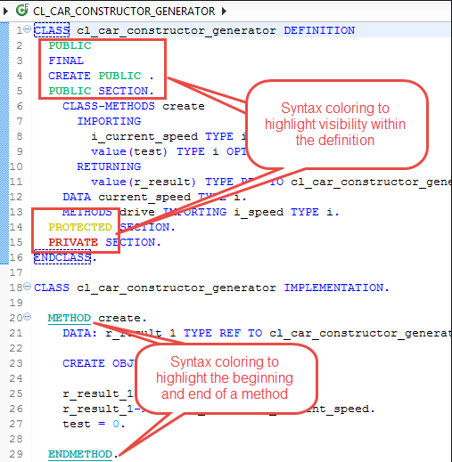

# Welcome to the Hands-On - ABAP RESTful Application Programming Model (RAP) - Scenario Managed/Draft

This repository offers solutions for the hands-on exercises available in the internal training on RAP provided by msg group.

## Hands-On - Prerequisites

* Minimum system prerequisite **SAP S/4HANA 2020 FPS01**
* User available on ABAP development system (backend / frontend)
* Eclipse + installed ABAP Development Tools (ADT) ([Eclipse 2021-03](https://www.eclipse.org/downloads/) or above is recommended)
* Basic knowledge of ABAP & ABAP CDS Views 
* User in SAP Business Technology Platform (SAP BTP) with access to SAP Web IDE
* SAP BTP destination to ABAP development system (frontend) which is enabled for usage in SAP Web IDE

## Hands-On - List Report and Object Page - Scenario Managed/Draft

### Chapter 1
some text

#### Solution 1
This is a code snippet (with ABAP as language )

```abap
@AbapCatalog.viewEnhancementCategory: [#NONE]
@AccessControl.authorizationCheck: #NOT_REQUIRED
@EndUserText.label: 'RAP HandsOn: Room Reservation (Basic)'
@Metadata.ignorePropagatedAnnotations: true
@ObjectModel.usageType:{
    serviceQuality: #X,
    sizeCategory: #S,
    dataClass: #MIXED
}

@VDM.viewType: #BASIC

define view entity ZRAPH_I_RoomReservationWD
  as select from zraph_a_room_rsv
{
  key room_resvn_uuid       as RoomResvnUUID,
      parent_uuid           as TravelUUID,
      room_resvn_id         as RoomResvnID,
      hotel_id              as HotelID,
      begin_date            as BeginDate,
      end_date              as EndDate,
      room_type             as RoomType,
      @Semantics.amount.currencyCode: 'CurrencyCode'
      room_resvn_price      as RoomResvnPrice,
      currency_code         as CurrencyCode,
      local_last_changed_at as LocalLastChangedAt
}
```
This is link to an image


#### Solution 2
This is a class
```abap
"! Local Message Handler Class for processing instance-specific booking supplement messages.
"! Method handle_booking_messages will process all provided messages and add errors and aborts to the RAP framework tables
CLASS lcl_message_helper DEFINITION CREATE PRIVATE.

  PUBLIC SECTION.
    "! Table Type for failed instances of the CDS View ZRAPH_I_BookingSupplement_U
    TYPES bookingsupplement_failed   TYPE TABLE FOR FAILED   zraph_i_bookingsupplement_u.

    "! Table Type for reported instances of the CDS View ZRAPH_I_BookingSupplement_U
    TYPES bookingsupplement_reported TYPE TABLE FOR REPORTED zraph_i_bookingsupplement_u.

    "! Processing provided messages for an booking instance for the RAP framework.
    "! @parameter cid                  | Content ID for which messages are provided
    "! @parameter travel_id            | Key TravelID for which messages are provided
    "! @parameter booking_id           | Key BookingID for which messages are provided
    "! @parameter bookingsupplement_id | Key BookingSupplementID for which messages are provided
    "! @parameter messages             | Table containing the provided messages for a booking instance
    "! @parameter failed               | RAP framework table into which the provided messages are added
    "! @parameter reported             | RAP framework table into which the provided messages are added
    CLASS-METHODS handle_bookingsuppl_messages
      IMPORTING cid                  TYPE string OPTIONAL
                travel_id            TYPE /dmo/travel_id OPTIONAL
                booking_id           TYPE /dmo/booking_id OPTIONAL
                bookingsupplement_id TYPE /dmo/booking_supplement_id OPTIONAL
                messages             TYPE /dmo/if_flight_legacy=>tt_message
      CHANGING  failed               TYPE bookingsupplement_failed
                reported             TYPE bookingsupplement_reported.
ENDCLASS.

CLASS lcl_message_helper IMPLEMENTATION.
  METHOD handle_bookingsuppl_messages.
    LOOP AT messages INTO DATA(message) WHERE msgty = 'E' OR msgty = 'A'.
      INSERT VALUE #( %cid      = cid
                      travelid  = travel_id
                      bookingid = booking_id ) INTO TABLE failed.
      INSERT zraph_cl_travel_auxiliary=>map_bookingsupplement_message( travel_id            = travel_id
                                                                       booking_id           = booking_id
                                                                       bookingsupplement_id = bookingsupplement_id
                                                                       message              = message ) INTO TABLE reported.
    ENDLOOP.
  ENDMETHOD.
ENDCLASS.

"! Local Handler Class for processing transactional behavior of BookingSupplement instances.
"! The class provides the following methods:
"!<ul><li>update_bookingsupplement   | Updating existing BookingSupplement instances</li>
"!    <li>delete_bookingsupplement   | Deleting existing BookingSupplement instances</li>
"!    <li>fill_bookingsupplement_inx | Filling the control structure of changed BookingSupplement fields</li></ul>
CLASS lhc_supplement DEFINITION INHERITING FROM cl_abap_behavior_handler.

  PRIVATE SECTION.
    TYPES:
      "! Table type based on Booking BO structure
      booking_update           TYPE TABLE FOR UPDATE zraph_i_booking_u,
      "! Table type based on BookingSupplement BO structure
      bookingsupplement_update TYPE TABLE FOR UPDATE zraph_i_bookingsupplement_u.

    METHODS:
      "! Updating existing BookingSupplement instances.
      "! @parameter bookingsupplement_update | Table providing the BookingSupplement instances to be updated
      update_bookingsupplement FOR MODIFY
        IMPORTING bookingsupplements_update FOR UPDATE bookingsupplement,
      "! Deleting existing BookingSupplement instances.
      "! @parameter bookingsupplement_delete | Table providing the BookingSupplement instances to be deleted
      delete_bookingsupplement FOR MODIFY
        IMPORTING bookingsupplements_delete FOR DELETE bookingsupplement,
      "! Filling the control structure of changed BookingSupplement fields.
      "! @parameter bookingsupplement_update | Table providing the BookingSupplement instances to be updated
      "! @parameter bookingsupplement_inx    | Returned control structure with changed fields being flagged
      fill_bookingsupplement_inx IMPORTING bookingsupplement_update     TYPE LINE OF bookingsupplement_update
                                 RETURNING VALUE(bookingsupplement_inx) TYPE /dmo/if_flight_legacy=>ts_booking_supplement_inx.
ENDCLASS.

CLASS lhc_supplement IMPLEMENTATION.

  METHOD update_bookingsupplement.
    DATA messages TYPE /dmo/if_flight_legacy=>tt_message.

    " Looping over all BookingSupplements to be updated
    LOOP AT bookingsupplements_update ASSIGNING FIELD-SYMBOL(<bookingsupplement_update>).

      " Calling the legacy function while providing all BookingSupplements and their respective control structure
      CALL FUNCTION '/DMO/FLIGHT_TRAVEL_UPDATE'
        EXPORTING
          is_travel              = VALUE /dmo/if_flight_legacy=>ts_travel_in(                travel_id = <bookingsupplement_update>-travelid )
          is_travelx             = VALUE /dmo/if_flight_legacy=>ts_travel_inx(               travel_id = <bookingsupplement_update>-travelid )
          it_booking_supplement  = VALUE /dmo/if_flight_legacy=>tt_booking_supplement_in(  ( /dmo/cl_travel_auxiliary=>map_bookingsupplemnt_cds_to_db( CORRESPONDING #( <bookingsupplement_update> ) ) ) )
          it_booking_supplementx = VALUE /dmo/if_flight_legacy=>tt_booking_supplement_inx( ( fill_bookingsupplement_inx( <bookingsupplement_update> ) ) )
        IMPORTING
          et_messages            = messages.

      " Message Handling
      lcl_message_helper=>handle_bookingsuppl_messages(
        EXPORTING
          cid                  = <bookingsupplement_update>-%cid_ref
          travel_id            = <bookingsupplement_update>-travelid
          booking_id           = <bookingsupplement_update>-bookingid
          bookingsupplement_id = <bookingsupplement_update>-bookingsupplementid
          messages             = messages
        CHANGING
            failed   = failed-bookingsupplement
            reported = reported-bookingsupplement ).
    ENDLOOP.
  ENDMETHOD.

  METHOD delete_bookingsupplement.
    DATA messages TYPE /dmo/if_flight_legacy=>tt_message.

    " Looping over all BookingSupplements to be deleted
    LOOP AT bookingsupplements_delete INTO DATA(bookingsupplement_delete).

      " Calling the legacy function with action code BookingSupplement Deletion
      CALL FUNCTION '/DMO/FLIGHT_TRAVEL_UPDATE'
        EXPORTING
          is_travel              = VALUE /dmo/if_flight_legacy=>ts_travel_in(     travel_id  = bookingsupplement_delete-travelid )
          is_travelx             = VALUE /dmo/if_flight_legacy=>ts_travel_inx(    travel_id  = bookingsupplement_delete-travelid )
          it_booking             = VALUE /dmo/if_flight_legacy=>tt_booking_in(  ( booking_id = bookingsupplement_delete-bookingid ) )
          it_bookingx            = VALUE /dmo/if_flight_legacy=>tt_booking_inx( ( booking_id = bookingsupplement_delete-bookingid ) )
          it_booking_supplement  = VALUE /dmo/if_flight_legacy=>tt_booking_supplement_in( (  booking_supplement_id = bookingsupplement_delete-bookingsupplementid
                                                                                             booking_id            = bookingsupplement_delete-bookingid ) )
          it_booking_supplementx = VALUE /dmo/if_flight_legacy=>tt_booking_supplement_inx( ( booking_supplement_id = bookingsupplement_delete-bookingsupplementid
                                                                                             booking_id            = bookingsupplement_delete-bookingid
                                                                                             action_code           = /dmo/if_flight_legacy=>action_code-delete ) )
        IMPORTING
          et_messages            = messages.

      " Message Handling
      IF messages IS NOT INITIAL.
        lcl_message_helper=>handle_bookingsuppl_messages(
         EXPORTING
           cid                  = bookingsupplement_delete-%cid_ref
           travel_id            = bookingsupplement_delete-travelid
           booking_id           = bookingsupplement_delete-bookingid
           bookingsupplement_id = bookingsupplement_delete-bookingsupplementid
           messages             = messages
         CHANGING
           failed   = failed-bookingsupplement
           reported = reported-bookingsupplement ).
      ENDIF.
    ENDLOOP.
  ENDMETHOD.

  METHOD fill_bookingsupplement_inx.
    CLEAR bookingsupplement_inx.
    bookingsupplement_inx-booking_supplement_id = bookingsupplement_update-bookingsupplementid.
    bookingsupplement_inx-action_code           = /dmo/if_flight_legacy=>action_code-update.
    bookingsupplement_inx-booking_id            = bookingsupplement_update-bookingid.
    bookingsupplement_inx-supplement_id         = xsdbool( bookingsupplement_update-%control-supplementid = if_abap_behv=>mk-on ).
    bookingsupplement_inx-price                 = xsdbool( bookingsupplement_update-%control-price        = if_abap_behv=>mk-on ).
    bookingsupplement_inx-currency_code         = xsdbool( bookingsupplement_update-%control-currencycode = if_abap_behv=>mk-on ).
  ENDMETHOD.
ENDCLASS.
```
### Chapter 2
some other text

...

## Hands-On - List Report and Object Page Extensions - Scenario Managed/Draft

### Chapter 1
some text

### Chapter 2
...

## Hands-On - RAP Generator & XSO Framework

### Chapter 1
...

### Chapter 2
...

## License
Copyright (c) 2021 msg group. All rights reserved. This project is licensed under the Apache Software License, version 2.0 except as noted otherwise in the [LICENSE](LICENSES/Apache-2.0.txt) file.