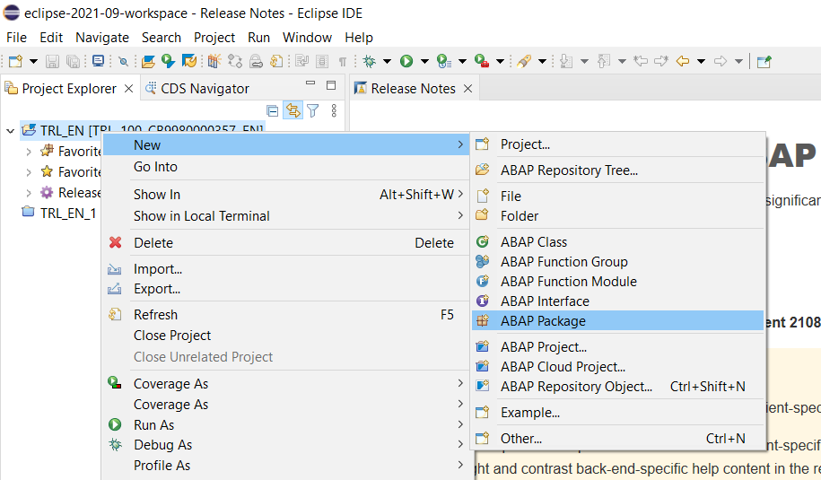
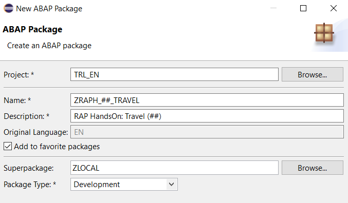
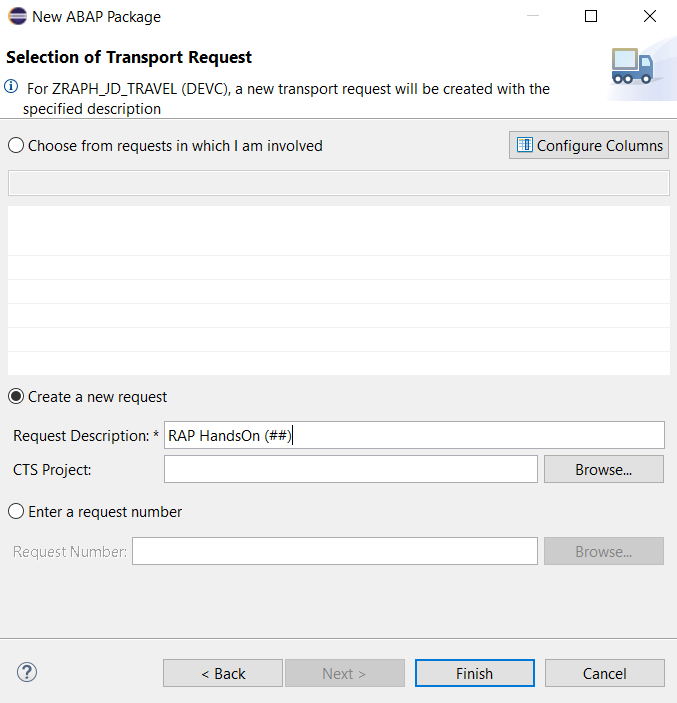
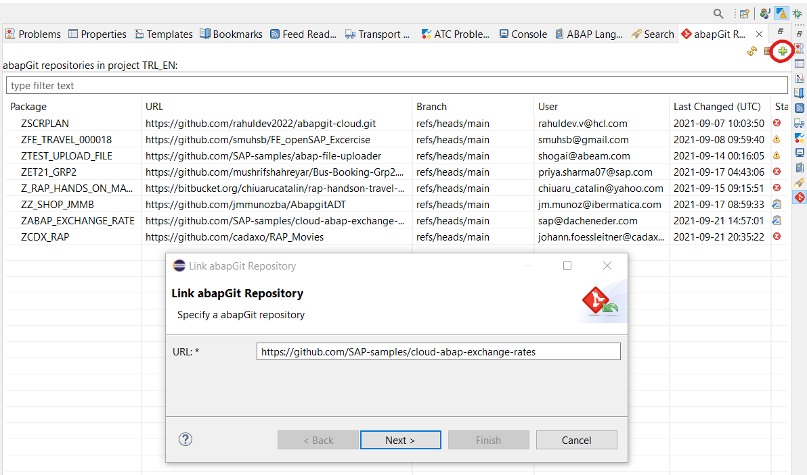

# Installation Guide: SAP Trial, Eclipse and BAS

## Preparing for the ERP Praktikum
For our course we will rely on SAP's Business Technology Platform Trial ABAP Environment. To get ready for developing we have to set up some things first:  
1. [Register for a SAP BTP Trial Account (~10min)](#markdown-header-1-sap-btp-trial-account)  
2. [Create an ABAP Trial Environment (~5min)](#markdown-header-2-abap-trial-environment)  
3. [Install Eclipse with necessary plugins (~20min)](#markdown-header-3-install-eclipse-with-necessary-plugins)  
4. [Add the BTP Trial as ABAP Project to Eclipse (~5min)](#markdown-header-4-add-the-btp-trial-as-abap-project-to-eclipse)  
5. [Import some required development objects from Git (~25min, may be partially optional)](#markdown-header-5-import-some-required-development-objects-from-git)  
6. [Install SAP Business Application Studio (~10min)](#markdown-header-6-install-sap-business-application-studio)

### 1. SAP BTP Trial Account
First, we will register for a BTP Trial Account. Therefore, go to
[SAP's website](https://www.sap.com/index.html) and register for an SAP account at the top right (you could e.g. provide 'University of Passau' as company, 'Training' as department and 'Student' as relationship or whatever seems fit to you). After confirming the mail you have to set a password and then log in.

Next, you have to register for the BTP Trial itself. Go to the [BTP Cockpit](https://account.hanatrial.ondemand.com/trial/). You'll have to provide your phone number for 2FA and SAP to ensure that you won't create unlimited amounts of accounts - but you can be sure that they'll never bother you using the phone number!  

Select *US East (VA) - AWS* as your region and continue - the generation of your account might take roughly two minutes.

Afterwards, click *Go To Your Trial Account* to get started - the opened Cockpit might be a useful browser bookmark!

### 2. ABAP Trial Environment
[^ Top of page](#)  
With our SAP BTP Trial Account up and running we now want to oboard to the ABAP Environment Trial. Enter the [BTP Cockpit](https://account.hanatrial.ondemand.com/trial/) (or stay where you've ended the first substep).

Click *Boosters* on the left, use the search and start *Prepare an Account for ABAP Trial*. After a minute you should get a success message and store the *Service Key* on your computer - this will be needed to connect the ABAP Trial with Eclipse later on.

You can close the BTP Cockpit now.

### 3. Install Eclipse with necessary plugins
[^ Top of page](#)  
Next, we have to install the local development environment. For this, SAP switched from their own solution to the Eclipse IDE with an ABAP Development Tool plugin.

>**Note** Even if you already happen to have Eclipse installed we urge you to install it again due to compatibility reasons with the Eclipse and ADT versions together with BTP Trial.

>**Note** You may have to **leave your company's / university's VPN**! The connection to Eclipse's plugin repository may fail otherwise.

Go to [Eclipse 2022-12](https://www.eclipse.org/downloads/packages/release/2022-12/r) and download the *Eclipse IDE for Java Developers* version fitting your operating system.  

>**Note** There are two different options: At the center top, the blue box offers a version with a **guided installer**. Further below (under *Packages*) you can choose to download a **ZIP-file** which simply has to be unpacked on your computer - this might be the easier option based on your preferences and includes the finished installation. But you can choose your preferred option yourself.

>**IMPORTANT NOTE for Mac users** Eclipse will self-modify its own info.plist file with some preferences during the first startup. This will lead to Eclipse not being allowed to open again after it was first started. The built-in [macOS Gatekeeper XProtect](https://support.apple.com/guide/security/protecting-against-malware-sec469d47bd8/web) prevents starting Eclipse after its self-modification due to this being interpreted as security threat. Therefore we have to define an [exception](https://stackoverflow.com/questions/70262544/eclipse-quit-unexpectedly-on-macos) in the Terminal. Please open the Terminal **directly after installing Eclipse and before running it** and execute the following command: `xattr -r -d com.apple.quarantine /Applications/Eclipse.app`

When the installation finished you can launch Eclipse.  
You will be asked for a workspace and can set this as default for the future.

>**Note** You may have to **run Eclipse as administrator** in order to install add-ons.

Now we'll install the ABAP Development Tools (ADT): Click *Help* > *Install new Software...* in Eclipse and enter https://tools.hana.ondemand.com/2022-12/ into the field *Work with*. Click *Add...* and store the plugin URL under the name *ADT*. After adding, the available tools will be loaded. Active the checkbox for *ABAP Development Tools* and click on *Next >*. On the following page again *Next >*, then accept the license terms and click *Finish*. You'll see the installation progress in the lower right corner of Eclipse. In some cases you have to explicitly state that you're trusting the signers SAP and Eclipse. After the installation Eclipse has to be restarted. Close the welcome tab and open the ABAP perspective by clicking *Window* > *Perspective* > *Open Perspective* > *Other* > *ABAP*.

Now we'll install the abapGit AddOn: Click *Help* > *Install new Software...* in Eclipse and enter https://eclipse.abapgit.org/updatesite/ this time. Select *abapGit for ABAP Development Tools (ADT)* for installation. Continue the installation wizard like you did for ADT. After the installation Eclipse has to be restarted. Now you can access the abapGit View by clicking *Window* > *Show View* > *Other...* > *abapGit Repositories*.

### 4. Add the BTP Trial as ABAP Project to Eclipse
#### Connecting Eclipse with BTP
[^ Top of page](#)  
Now we will add the previously created ABAP Trial instance as ABAP Project in Eclipse. If you have already opened the ABAP perspective before you are already good to go: Click on *Create an ABAP cloud project* in the *Project Explorer* on the left.

Here you have to select the option using a *Service Key* and continue with *Next >*. Click *Import...* on the next screen and select the service key file *default_key.json* which you've downloaded to your computer previously. Click *Next >* and then *Open Logon Page in Browser*. Here you might have to log into your new SAP Account again to verfiy the connection. When asked use *EN* as logon language and click *Finish*.

#### Creating a development package
You've successfully connected your development IDE with the ABAP Environment in the Business Technology Platform. Next, we will create a package and associated transport request. This package will be used to store all your development objects which we'll create during this course. To do so, right click on your new ABAP Project and select *New* > *ABAP Package*.

  

On the *Next >* wizard page, assign the Name `ZRAPH_##_TRAVEL` where the `##` has to be replaced with your personal *initials*. This ensures that everybody has his own package and we don't interfere with each others - we'll use the `##` throughout the course! The superpackage will stay ZLOCAL and you can check the box to save this as favorite package for easier access.

Continue with *Next >* and select the radio button *Create a new request* where you should provide some meaningful *Request Description* and can complete the wizard by pressing *Finish*. This transport request is required as you would normally e.g. transport such packaged changes from a development to a test system. In our case this won't happen but is necessary nontheless.

With this, you've completed the fourth preparation step.

### 5. Import some required development objects from Git
[^ Top of page](#)  
#### 5 a) Importing cloud-abap-exchange-rates objects required for our course
>**Note** This step might be superfluos. BTP Accounts are automatically distributed across different instances. So it could be that our required objects have already been imported from Git by another student. To check, if those objects are already available, please do the following: Mark the ABAP Project in Eclipse on the left and click `Ctrl + Shift + A`. Type `ZCL_PREPARE_CURRENCY_TEST`. If you find the class, you can skip this subchapter and continue with **5 b)** in order to configure the BAS. **If no class was found, you'll have to do the following steps!**

First, create another development package within `ZLOCAL` like in subchapter 4. Name it `ZABAP_EXCHANGE_RATE` and select your existing transport request. Now, open the abapGit plugin via *Window* > *Show View* > *Other...* > *abapGit Repositories*. Click the green plus button and provide https://github.com/SAP-samples/cloud-abap-exchange-rates as URL.

Continue with *Next >* and fill your package name `ZABAP_EXCHANGE_RATE`. Check the box *Pull after link* and click *Next >* again. Choose your transport request and click *Finish*. Press the refresh button in the repository overview until the import has finished.

Now we have to activate the imported elements. Click `Ctrl + Shift + F3` or press . Select all shown elements and continue with *OK*. Select all shown elements and click *Activate*.

Click  `Ctrl + Shift + A` and type `ZCL_PREPARE_CURRENCY_TEST` - mark it and press *OK*. Click into the opened source code editor and Press *F9* to run the class as ABAP Application (Console). You'll see some outputs confirming that currency exchange rates have been imported to the SAP system. Those will later be used to convert some amounts in our app.

#### 5 b) Importing ZRAPH objects required for our course
>**Note** This step might be superfluos. It could be that our required objects have already been imported from Git by another student. To check, if those objects are already available, please do the following: Mark the ABAP Project in Eclipse on the left and click `Ctrl + Shift + A`. Type `ZRAPH_HOTEL_NAME`. If you find two matches, you can skip this subchapter and continue with **subchapter 6** in order to configure the BAS. **If no files are found, you'll have to do the following steps!**

First, create another development package within `ZLOCAL` like before. Name it `ZRAPH_TRAVEL` and select your existing transport request. Now, open the abapGit plugin via *Window* > *Show View* > *Other...* > *abapGit Repositories*. Click the green plus button and provide https://bitbucket.org/erp-praktikum/rap-handson-travel-reference-model as URL.

Continue with *Next >* and fill your package name `ZRAPH_TRAVEL`. Check the box *Pull after link* and click *Next >* again. Choose your transport request and click *Finish*. Press the refresh button in the repository overview until the import has finished (there will probably be some irrelevant errors: *Pulled with errors*).

Now we have to activate the imported elements. Click `Ctrl + Shift + F3` or press . Select all shown elements and continue with *OK*. Select all shown elements and click *Activate*.

Click  `Ctrl + Shift + A` and type `ZRAPH_DATA_GENERATOR` - mark it and press *OK*. Click into the opened source code editor and Press *F9* to run the class as ABAP Application (Console). You'll see some outputs confirming that room reservation and hotel data has been generated in the SAP system. Great, we're good to go!

### 6. Install SAP Business Application Studio 
[^ Top of page](#)  
Our final step is to configure the Business Application Studio (BAS) which is the development environment for the FrontEnd. Here, our browser applications will be implemented later on. To get started, open the [BTP Cockpit](https://account.hanatrial.ondemand.com/trial/) again. Here, click on you *trial* subaccount, select *Services*, then *Instances and Subscriptions* on the left. Now click the *Go to Application* link for the *SAP Business Application Studio* and accept the legal disclaimer.

Once the BAS has opened, you'll have to *Create Dev Space*: Select the name *Fiori* and the application type *SAP Fiori* and click on *Create Dev Space*. Your Dev Space will automatically be started - this takes some minutes. Meanwhile you can store a browser bookmark for the BAS. Once it's *running*, open the Dev Space.

Click *View* > *Find Command...* or *Ctrl + Shift + P* and search for the command *CF: Login to Cloud Foundry* and select it with enter. Click enter again to confirm the preset Cloud Foundry endpoint, enter your BTP Trial user's mail, confirm it with enter and do the same for the password.  
Once you see the info message *You have been logged in.* you've finished necessary installations for our course!

>**Note** There's a quite common error which mich happen when logging in to Cloud Foundry. You might get an API endpoint error message. If this affects you, there's an easy workaround:

Click on *Terminal* > *New Terminal...* in the toolbar and type `cf login --sso` into the opened editor. Confirm the command with enter.

You'll get a link in order to retrieve a temporary passcode for logging in - open this URL from the BAS Terminal via `Ctrl + Click`. You might have to select the *Default Identity Provider* in the browser window and will get a passcode afterwards. Copy this passcode, paste it back into the BAS Terminal and click `Enter`.  
You won't see that the passcode was pasted, the input field will remain empty. Just be confident of yourself and press `Enter` anyways! You should get an *OK* message in the Terminal and are finally good to go.

Basically, everything is ready now - congratulations!  
**We're looking forward to see you** on March 20th **:)**

## Further Links
- [Eclipse Keyboard Shortcuts](Shortcuts.md)  
- [RAP HandsOn: Introduction](../part1/README.md)
