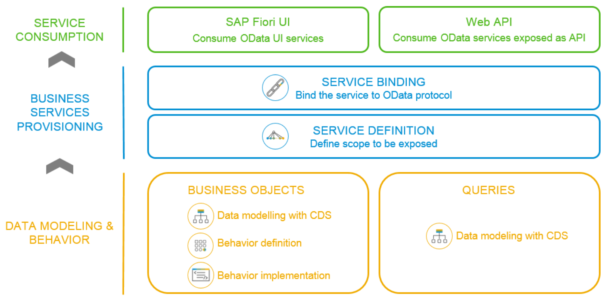
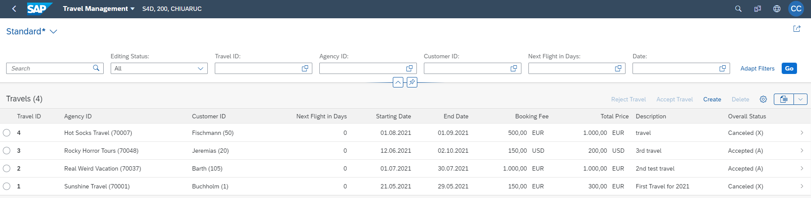
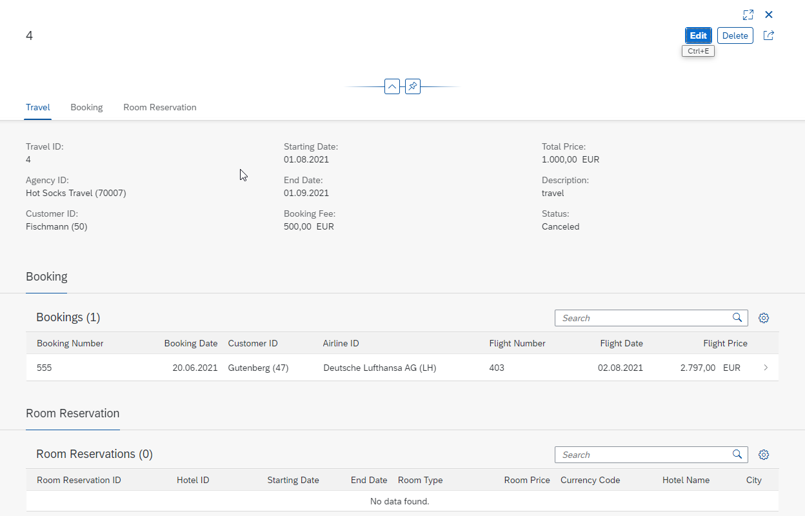
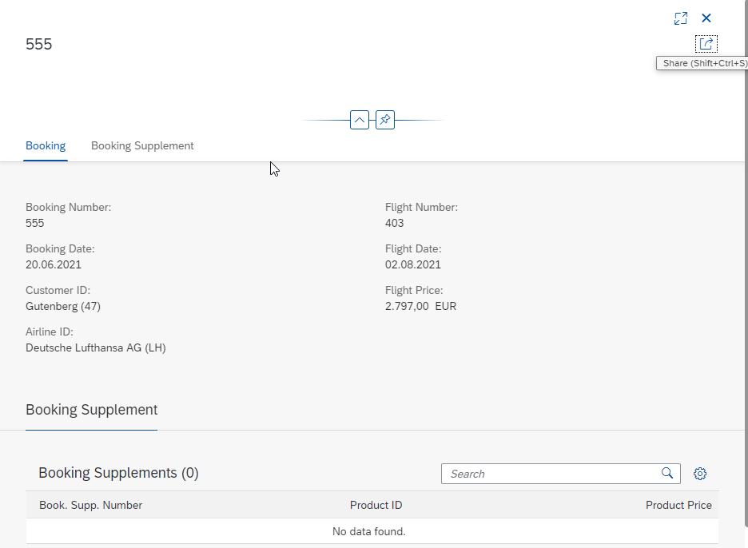
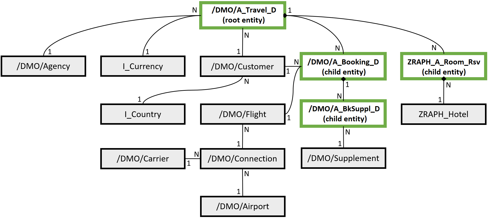

# Readme file for Part 1 - Introduction
## Overall description and high-level architecture
In this course we’ll create a SAP Fiori application with the help of a Virtual Data Model using ABAP CDS, Behavior Definitions & Implementations for the transactional behavior and OData via Service Definition & Binding for publishing our data from the BackEnd.

The finished Fiori app will display travel information (one travel possibly consisting of several flight bookings and room reservations). The main screen will list all travels stored in the database. Also, it allows to open an individual travel with its information shown in an object page and the associated bookings listed as well. From there you can navigate to the object page of an individual booking to see its data in detail.

The app will support transactional functionality (CRUD operations) with draft capabilities along with search and filtering. 

The following image should give you a high-level overview, which types of development objects are involved within the implementation of a transactional app in the context of the ABAP RESTful Application Programming Model.

## Mockups
The following mock-ups should already provide a rough overview how our app should look like in the end. 
The starting screen (List Report) should list all travels and provide some functionality to search and filter for instances as well as creating and deleting travels and the functionality to accept or reject a travel. 

The detailed view (Object Page) of a travel contains information about itself and lists the associated bookings and room reservations. Additionally, it provides an edit mode for the travel data. 

The detailed view (Object Page) of the bookings should provide its data and allow users to edit that information as well. Same goes for the room reservations object page.

## Technical Setup
We will use the following existing database tables for the travel, booking, booking supplement. You’ll find the relevant fields below. In addition to the existing database from the ABAP Flight Reference Scenario, we will create a new database table for storing the room reservations belonging to a specific travel.
- **/DMO/A_Travel_D** - General Travel Data (and some administrative information)
- **/DMO/A_Booking_D** - Booked Flights for Travel instances
- **/DMO/A_BkSuppl_D** - Booking Supplements for Booking instances

| Database Table    | Field Name |
| ----------- | ----------- |
| **/DMO/A_Travel_D**     | travel_uuid **(key)**|
|                     | travel_id        |
|                     | agency_id        |
|                     | customer_id      |
|                     | begin_date       |
|                     | end_date         |
|                     | booking_fee      |
|                     | currency_code    |
|                     | description      |
| **/DMO/A_Booking_D**    | booking_uuid **(key)** |
|                     | parent_uuid        |
|                     | booking_id        | 
|                     | booking_date        | 
|                     | customer_id        | 
|                     | carrier_id        | 
|                     | connection_id        | 
|                     | flight_date        | 
|                     | flight_price        | 
|                     | currency_code        | 
|                     | booking_status        | 
| **/DMO/A_BkSuppl_D**    | booksuppl_uuid **(key)**        | 
|                     | root_uuid         | 
|                     | parent_uuid        | 
|                     | booking_supplement_id        | 
|                     | supplement_id        | 
|                     | price        | 
|                     | currency_code        | 

As you can see in the diagram below, those tables also have associations to other instances in our scenario like Agency, Customer, Flight or Hotel. For our own Virtual Data Model we’ll concentrate on the DB tables for the instances which are marked in green, though. Those are basically representing the transactional data. The remaining master data will be mostly reused by accessing existing CDS views for sake of simplicity to enrich our app with external master data. 

With SAP S/4HANA 2020 additional supported scenarios within the ABAP RESTful Application Programming Model were introduced. The app created within this hands-on will be based on the scenario managed/draft. In comparision with the unmanaged scenario, where the developer would have to implement the basic CUD operations, in the managed scenario the CUD operations will be provided out of the box by RAP framework. Draft-enabled business objects persist the state of the transactional buffer after every transaction on a designated draft database table. This allows the end user to stop and continue work processes at any point in time, even with inconsistent data. For more detailed information about the draft concept, see [Draft](https://help.sap.com/viewer/fc4c71aa50014fd1b43721701471913d/202009.001/en-US/a81081f76c904b878443bcdaf7a4eb10.html).

 
 

 

