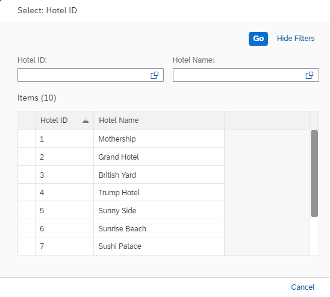

# Part 10b - a CDS Custom Entity as a Value Help
## Table of Contents 
* [Previous: 9. Extending the SAP Fiori List Report](../part9/README.md)  
* [Previous: 10a. CDS Custom Entity](1.CustomEntityIntro.md)  
* **Current: 10b. Extending the SAP Fiori List Report**  
    * [Requirement](#markdown-header-requirement)  
    * [Create Custom Entity](#markdown-header-create-custom-entity)  
    * [Implementation Class logic: Part 1 Basic functionality](#markdown-header-implementation-class-logic-part-1-basic-functionality)  
    * [Implementation Class logic: Part 2 Filters](#markdown-header-implementation-class-logic-part-2-filters)  
    * [Limitations](#markdown-header-limitations)  
* [Next: 10c. CDS Custom entity in RAP Context](3.Rap-CDS_CustomEntity.md) 


## Requirement
[^ Top of page](#)  
We have to provide a value help for the field `Hotel External ID`, the problem arrives when our data is not provided via a CDS or at least stored in a database table.
Our data, is provided using an ABAP Function Module (FM).

## Implementation

### Create Custom Entity
[^ Top of page](#)  
In contrast to "normal" CDS views that reads data from the database tables or other CDS views, the so called custom entities act as a wrapper for a code based implementation that provides the data instead of a database table or a CDS view.

To create the custom entity do the following steps:
1. Right-click on the folder Data Definition and select New Data Definition.
( If you don't have 'data definition' folder, right click on the package->New->Other ABAP repository objects and search for 'Data Definition' ) 
2. Add a name `zraph_ce_hotelextid_###` and Description. Then press `Next`.   
>Hint!
Do not press `Finish` because we want to select a template.
3. Select your transport request and press `Next`.
4. Select custom entity template `Define Custom entity with Parameters` and press `Finish`.

>Info!
Even if we don't have parameters we have to select this template. We'll remove the additional parameters code in the next step.

5. Remove the statement:
```abap
with parameters parameter_name : parameter_type`
```

6. Add the fields needed for the value help and save it.
```abap
Hotel_external_ID   : zraph_hotel_ext_id;
Hotel_name          : zraph_hotel_name;
```
7. Create a new abap class by right clicking on the package and select `New` -> `ABAP Class`.
8. A new ABAP class dialogue opens. Here you have to enter the following:
```abap
Name: ZRAPH_CL_HotelExtID_##
Description: <class description>
Interfaces: Click `Add` and put 'if_rap_query_provider'  
```
9. `Save` and `Activate` the class.
10. Now add the annotation to the cds view:
```abap
@ObjectModel.query.implementedBy: 'ABAP:ZRAPH_CL_HotelExtID_##'.
```
11. `Save` and `Activate` the custom entity.

**Solution**:   
[^ Top of page](#)  
[ZRAPH_CE_HOTELEXTID_###](sources/CustomEntity_creation.txt)  
[ZRAPH_CL_HotelExtID_###](sources/Implementation_class_creation.txt)


### Implementation Class logic: Part 1 Basic functionality
[^ Top of page](#)  
After having created the custom entity `zraph_ce_hotelextid_###`  we now have to enhance the query implementation class `ZRAPH_CL_HotelExtID_###` that we have created earlier.
When implementing the query you have to know that the implementation class only offers one method which is called `select`.

>Hint!   
If you didn't add the interface `IF_RAP_QUERY_PROVIDER` in the previous step to the query implementation class, you can add it now. Using the quick fix `CTR+1` to add the implementation for the method `if_rap_query_provider`~`select`.

**The logic is as follows**: we have to write our code in the select method:  
    - verify the method `is_data_requested( )` of object `io_request`
    - call the function module `Z_RAPH_TRAVEL_API` to get the data.
    - if data is requested true fill the method `set_data`  of object `io_response` with the result table.
    - Requesting and Setting Count : `check is_total_numb_of_rec_requested( )`, if true fill the method `set_total_number_of_records` of object `io_response` with the nr of records in the result table.
    

>Hint!
The 2 methods: `set_data` and `set_total_number_of_records` of io_response are mandatory.

**Solution**  
[zraph_cl_hotelextid_part1](sources/zraph_cl_hotelextid_Part1.txt)


### Extend the table with a new field
[^ Top of page](#)  
- Open the database table `ZRAPH_##_RoomRsv` and add a new field `Hotel_external_id` just after the field `Hotel_id`. On the UI we should see the label `Hotel External ID`. 
- Enhance the CDS `ZRAPH_##_I_RoomReservationWDTP` with the new field and add the alias `HotelExternalID`. 
- Enhance the CDS `ZRAPH_##_C_RoomReservationWDTP` and the metadata. Our new field should be shown on the UI next to the `HotelID`.
- `SAVE` and `ACTIVATE` the CDS View.
- Open the Behavior Definition `ZRAPH_##_I_TravelWDTP` and add the `HotelExternalID` to the mapping of entity `BookingSupplement` and use the quick fix to regenerate the draft table.
- `SAVE` and `ACTIVATE`.


### Add annotations for value help 
[^ Top of page](#)  
- Open the projection view for your inventory data `ZRAPH_##_C_RoomReservationWDTP`.   
- Add the annotation `@Consumption.valueHelpDefinition` to the field `HotelExternalID`.   
- `Save` and `Activate`.

**Solution**  
```abap
      ...
      @Consumption.valueHelpDefinition: [ {entity: {name: 'zraph_ce_hotelextid_###', element: 'hotel_external_id' } } ]
      HotelExternalID,
      ...
```

### Add the custom entity to your service definition
[^ Top of page](#)  
- Open the Service Definition `ZRAPH_##_TRAVELWDTP`.
- Add the statement: `expose ZRAPH_CE_HOTELEXTID_### as HotelExt;` to add the custom entity to the OData service.  
- `Activate` your changes.


### Test the service
[^ Top of page](#)  
- Open the service binding `ZRAPH_##_UI_TRAVELWDTP_V2`.  
- Check if your Custom entity exists in `Entity set and Associations` area, if it doesn't exist press `Unpublish` and the `Publish` again.  
- Select the Travel projection view from the list and press `Preview`.
- Press `Go` button and select one entry from the list.
- Go to `Room Reservation` table click `create`.
- Select a value for `HotelExternalID` a new pop up should open like in the pic below.

 


### Implementation Class logic: Part 2 Filters
[^ Top of page](#) 
The value help shows all the data from the FM, now we have to implement the filters, more exactly what happens if we search in the VH based on `Hotel ID` or `Hotel Name`. 
This is an example of how to use filter as an sql string.  

**The logic is as follows:**  
[^ Top of page](#)  
We have to use the object `io_request`, here we have the method `get_filter()`.
`Get_filter` method is giving us all the filters that were requested from the ui, by getting an interface instance of `IF_RAP_QUERY_FILTER`
The `get_filter()` is having 3 methods `get_as_ranges` , `get_as_sql_string` ,`get_as_tree`.  
In our example, we would use the `get_as_sql_string()` we can use the result directly in a select over the internal table which contains the data.


**Test the Implementation**
[^ Top of page](#)  


**Solution**  
[zraph_cl_hotelextid_part2](sources/zraph_cl_hotelextid_Part2.txt)


>**Addition Information**   
We can have multiple custom entities and one implementation class. To make the difference between the custom entity we can use the method `get_entity_id` of the interface `IF_RAP_QUERY_REQUEST`, which returns the requested CDS entity name.  
We can use this return value: to check if the implementation class is used in the right custom entity, to implement different logic in each custom entity, etc.


### Limitations:
[^ Top of page](#)  

1. We can show the Hotel ID from the custom entity, but the name/description cannot be added in the same way as other id+description fields.

a. If we put annotation  `@ObjectModel.text.association: '_Hotel'`  , at runtime in service binding we will have 'hotel' association is not allowed.  
b. We cannot used the field `Name` from the asscociation with a custom entity.

```abap

      @ObjectModel.text.association: '_Hotel'  
      @Consumption.valueHelpDefinition: [ {entity: {name: 'ZRD_CE_HOTELEXTID', 
                                           element: 'Hotel_ID' } } ]
      HotelID,
     _Hotel.Name         as HotelName,
```  

## Next step
[^ Top of page](#)  
[10c. CDS Custom entity in RAP Context](3.Rap-CDS_CustomEntity.md) 