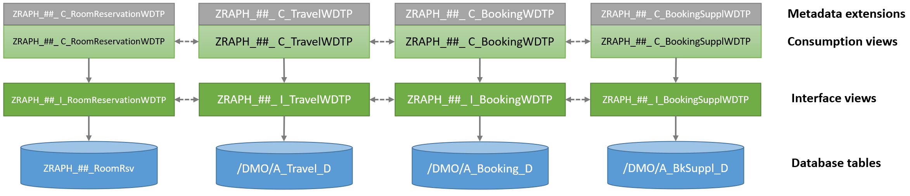
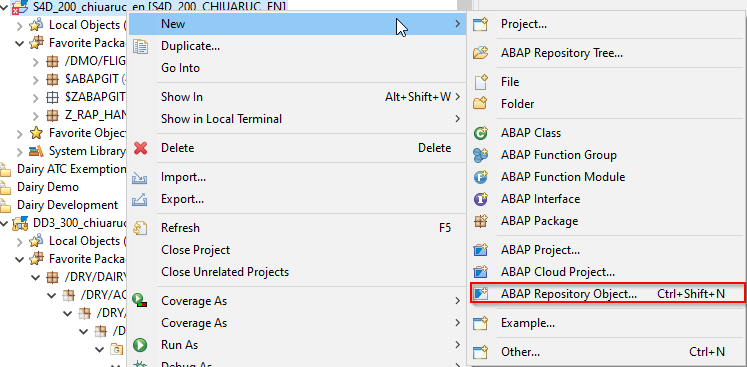
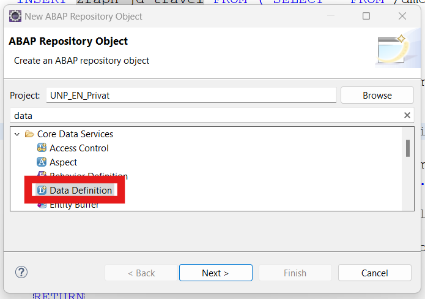
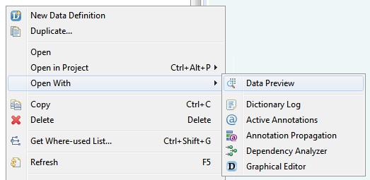
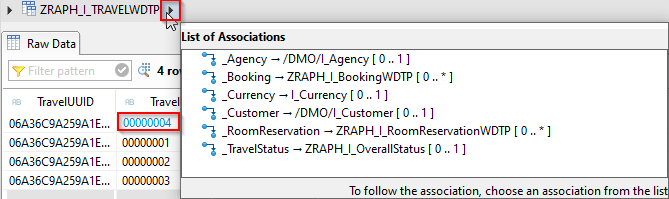

# Readme file for Part 3 - Creating the Virtual Data Model (VDM) via ABAP CDS Views
## Requirement
For the transactional data processing in our Travel App we need to define a business object (BO) structure within the CDS data model. Prior to the ABAP RESTful Application Programming Model you would have used BOPF for this. But RAP is providing a completely new integrated framework for this. The business object structure consists of a entity tree linked by special associations, also known as compositions. Every business object entity is represented by an own CDS Interface View.
From a design perspective, we will decouple the business object layer and the service layer – therefore we need separate CDS views for the different layers. Of course, they have to be in some sort of relation with each other, which is illustrated by the following image. Keep in mind that Travel is our root entity and has RoomReservation and Booking as its childs with BookingSupplement being a grand-child of the root. 


First, we will create the so-called “basic views” which fetch the data from the preexisting database tables and enrich them with semantic information. One level higher we have our transactional interface views which are used to define the business object tree. According to our requirement, the business objects have to support all CRUD operations. The ROOT node of our business object is the Travel instance, its child nodes are Booking and RoomReservation instances. A Travel instance can have any number of Bookings or RoomReservations – no item (yet) is possible as well. On the contrary, those instances cannot exist without its parent, a Travel instance.
As third level in the composition tree hierarchy we have the Booking Supplement which is a child of a Booking instance and therefore a grandchild for Travel.
The Consumption views and Metadata Extensions are mainly used for the generation of the service layer and therefore explained in a later step – they do not have to be considered now.
## Technical Information
In order to define the our entity tree we have to create a CDS view for each instance which then together represent the compositional hierarchy. For the root business object we need to use the following syntax:
```abap
define root view entity root_entity
  as select from data_source [as alias] 
  composition [min..max] of child_entity as _comp_name
  [additional_composition_list]	
  [association_list]
{
   element_list
}
```
For the child entities the following syntax applies:
```abap
define view entity child_entity
   as select from data_source [as alias]
   association to parant parent_entity as _assoc_name on condition_exp
   [additional_association_list]
{
   element_list
}
```
> **Remark**:
> As you can observe we will use across the hands-on the next generation *CDS View Entities*. One of the main differences between CDS DDIC-based view (`define view`) and CDS view entity (`define view entity`), is that the latter does not have an associated SQL view, and the name of the Data Definition object in the Project Explorer and the name of the CDS entity specified after the keyword `DEFINE VIEW ENTITY` are identical. This makes the lifecycle of CDS View entities way easier and also the activation runs faster.

## Implementation
Please log into your SAP System in Eclipse via the logon language EN. Otherwise, by standard we won’t see our FrontEnd texts later on when we open the Fiori app in the browser.
### Creation of basic interface views
The following existing database tables from the persistency layer described previously will now be used as a base for our CDS Base Views:

* /DMO/A_Travel_D
* /DMO/A_Booking_D
* /DMO/A_BkSuppl_D
* Z##_A_Room_Rsv

We now create a separate CDS view for each of those four database tables following these naming conventions as basic layer for data selection. Basically they do nothing more than selecting the data from the existing database tables while renaming some fields to be easy to understand (semantical field names). This comes in handy considering some century-old databases with cryptic, german or just too short field names as naming restrictions in CDS are looser. Later we will build our transactional CDS Interface Views on top of this (the prefix `I` is used for Interface Views): 

* Z##_I_TravelWD
* Z##_I_BookingWD
* Z##_I_BookingSupplementWD
* Z##_I_RoomReservationWD

> **Hint**: `WD` is the abbreviation for "with draft" in order to know that this artefacts is consumed by an draft enabled application.

Simply open the context menu of the ABAP Project and create a CDS Data Definition like this:




> **Hint**: Please use as template for the CDS View creation the `Define view entity` template in order to use the next generation CDS Views introduced starting with **SAP S/4HANA 2020**.

> **Hint**: By clicking Ctrl + Space within the CDS Editor you’ll get some options for context-sensitive code completion. Here you can use the option “Insert all elements (template)” to save a lot of time and avoid copying every column manually from the database table. 

In the CDS Views all fields, which are available in the database tables should be selected. Their key fields should be marked as key. One exception is the travel_price for the Travel instance – we won’t select this as we’ll instead calculate the total price of a Travel, its childs and grandchilds dynamically in a later chapter. For the amount and currency fields the annotations `@Semantics.currencyCode: true` and `@Semantics.amount.currencyCode: '<currency field name>'` should be used to enrich the CDS view with semantical information. 

Don’t forget to activate the new CDS views once they are finished and saved. Now let’s verify if our created CDS Views already access the database tables correctly. This can be easily achieved by either pressing `F8 (execute`) or running the data preview against our CDS view using the context menu (by right-clicking the CDS view in the Project Explorer).


#### Solution

- [DDLS_Z##_I_TravelWD](sources/Z_I_TravelWD.txt)
- [DDLS_Z##_I_BookingWD](sources/Z_I_BookingWD.txt)
- [DDLS_Z##_I_BookingSupplementWD](sources/Z_I_BookingSupplementWD.txt)
- [DDLS_Z##_I_RoomReservationWD](sources/Z_I_RoomReservationWD.txt)

### Creation of transactional Interface Views
As already discussed above, the created CDS Views are only selecting the data out of the database into a CDS entity. To actually take use of CDS’s advantages we will now add another layer to our Virtual Data Model by creating transactional CDS Views. 

For both entities, we now create a separate CDS view, following these naming conventions (the prefix `I` is used for Interface views whereas the suffix `WDTP` describes the draft capability enriching the transactional behavior):

- Z##_I_TravelWDTP 	
- Z##_I_BookingWDTP
- Z##_I_BookingSupplementWDTP
- Z##_I_RoomReservationWDTP

In the CDS Views all fields, which are available should be selected from the underlying, previously created CDS Views. This time, we’d also like to expose the associations from Travel to Booking respective RoomReservation and the other way around (i.e. the composition of our BO tree). Same goes for the relationship between Booking and BookingSupplement. As those CDS Views are dependent on each other it is not possible to activate them separately. Don’t forget to also publish the associations from the composition tree. Instead you have to activate them together at the same time by using `Ctrl + Shift + F3` or  once you’re finished implementing.

#### Solution

* [DDLS_Z##_I_TravelWDTP](sources/Z_I_TravelWDTP.txt)
* [DDLS_Z##_I_BookingWDTP](sources/Z_I_BookingWDTP.txt)
* [DDLS_Z##_I_BookingSupplementWDTP](sources/Z_I_BookingSupplementWDTP.txt)
* [DDLS_Z##_I_RoomReservationWDTP](sources/Z_I_RoomReservationWDTP.txt)

As a next step, we want to create further connections to the existing master data for Customer, Carrier, Agency, Currency, Supplement, SupplementText, Hotel and HotelRoomType as shown before. Those won’t be transactional or CRUD enabled. They are only necessary to access additional information not stored within Travel, Booking, BookingSupplement or RoomReservation instances themselfes. The associations should be published in the CDS Views in order to access their fields when consuming the data. Here we won’t create our own CDS Views for sake of simplicity but will instead reuse the existing CDS views of the package /DMO/FLIGHT_REUSE provided by SAP and just refer to them. Please use the appropriate foreign key to add associations to the following CDS Views where possible: `/DMO/I_Agency`, `/DMO/I_Customer`,
`/DMO/I_Carrier`, `/DMO/I_Connection`, `/DMO/Supplement`, `/DMO/I_SupplementText`, `ZRAPH_I_Hotel`, `ZRAPH_I_HotelRoomType`, `I_Currency`.
#### Solution

* [DDLS_Z##_I_TravelWDTP](sources/Z_I_TravelWDTP_EXT1.txt)
* [DDLS_Z##_I_BookingWDTP](sources/Z_I_BookingWDTP_EXT1.txt)
* [DDLS_Z##_I_BookingSupplementWDTP](sources/Z_I_BookingSupplementWDTP_EXT1.txt)
* [DDLS_Z##_I_RoomReservationWDTP](sources/Z_I_RoomReservationWDTP_EXT1.txt)

Now after publishing the associations, the data preview functionality becomes more powerful. Once again, execute the data preview for the Travel CDS View. Mark one Travel instance by clicking on it and then press the small arrow at the top besides the name of the view. The system provides a list of all associations where you can drill into and see the data of all its associated items.



Next we want to add a new field for Criticality. This will be used to define certain thresholds on which a Booking instance is marked in red, yellow or green depending on its `FlightPrice`. For this, add the field `Criticality` with the case syntax to your view `Z##_I_BookingWDTP`. The value 3 will be shown as red in the Fiori App while 2 is yellow, 1 is green and 0 is neutral (grey). You can choose some thresholds on your own, just make sure that your values make sense using the Data Preview.
```abap
define view entity Z##_I_BookingWDTP
  ...   	
      case when FlightPrice <  200 then 3
           when FlightPrice >= 200 and FlightPrice < 500 then 2
           when FlightPrice >= 500 then 1
           else 0
      end                         as Criticality,
  ...   	
  

```
### Creation of Projection Views
The Interface Views describe all available entities and elements of the business object hierarchy. In order to use them with a service, like e.g. OData for Fiori UI, we need a projection layer consisting of CDS Consumption Views which define the data model and functionality being available via this service. This UI service includes UI layout annotations, text elements, value helps and search which will later be described in the OData service metadata.

Such UI layout annotations can be added in the CDS View directly above the field in question of the selection list. As this can easily overload the CDS view and make it hard to read, it is a good practice to outsource those UI layout annotations into *Metadata Extensions (MDE)*. Additionally, this creates the possibility of one Interface View being used in several different OData services where requirements might differ requiring dedicated UI Annotations. Besides better readability this also allows several layers of metadata extensions: Existing CDS views with an MDE extension layer `#CORE` (e.g. standard implementation by SAP) can be reused with a second MDE in layer `#CUSTOMER` in which you only override those annotations not suited to your case without having to define others again. To enable this, we add the annotation `@Metadata.allowExtensions: true` to each CDS View which you want to annotate via an MDE.

In our scenario we’ll define the following four Projection Views (reading from the Interface Views with the prefix **C** indicating it being intended for service consumption via e.g. OData):

* Z##_C_TravelWDTP 	
* Z##_C_BookingWDTP
* Z##_C_BookingSupplementWDTP
* Z##_C_RoomReservationWDTP

The relevant syntax is the following:
```abap
define [root] view entity <projection_view> as projection on <projected_view>
```
Now, let’s start with `Z##_C_TravelWDTP` step by step. Create a new Data Definition with the before-mentioned syntax exposing all fields from `Z##_I_TravelWDTP` while also exposing the Associations. Concerning associations: The composition of the child `Z##_I_BookingWDTP` has to be redirected to (the not yet created) `Z##_C_BookingWDTP` with the following syntax. The same has to be done for the second child `Z##_C_RoomReservationWDTP`.
```abap
_Booking : redirected to composition child Z##_C_BookingWDTP
```
You’ll find the final solution for our projection views further below as we’ll add the upcoming UI annotations step-by-step to the same structure of selected fields.

#### Defining Text Elements
To define a relationship between the elements `AgencyID` and `CustomerID` and their corresponding texts or descriptions, the text elements must be denormalized in the CDS projection view. Therefore the elements of the associated text provider views (`_Agency.Name` and `_Customer.LastName`) are included in the select list of the projection view. Their corresponding ID elements are annotated with `@ObjectModel.text.element`. At runtime, the referenced element is read from the database and filtered by the logon language of the OData consumer automatically. For detailed information, see: [Defining Text Elements]([https://link](https://help.sap.com/viewer/fc4c71aa50014fd1b43721701471913d/201909.001/en-US/338fa3f46f284a9f9408f0481d36f497.html)). Add this two text elements for the corresponding key field to your selection list.
#### Defining Value Helps
Value helps are defined in the source code of the CDS projection view `Z##_C_TravelWDTP` by adding the annotation `@Consumption.valueHelpDefinition` to the elements  `AgencyID`, `CustomerID` and
`CurrencyCode`. In this annotation, you specify the elements for which the value help dialog should appear on the UI. The value help annotation allows you to reference the value help provider view without implementing an association. You simply assign a CDS entity as the value help provider and specify an element for the mapping in the annotation. All fields of the value help provider are displayed on the UI. When the end user chooses one of the entries of the value help provider, the value of the referenced element is transferred to the corresponding input field on the UI. You don’t have to explicitly define a CDS entity as value help provider but can reuse any existing one for the field in question. For detailed information, see: [Simple Value Help]([https://link](https://help.sap.com/viewer/fc4c71aa50014fd1b43721701471913d/201909.001/en-US/9971cb3a97614009b078d2e5098296b7.html#loio9971cb3a97614009b078d2e5098296b7)). Add such value helps using the value help providers `/DMO/I_Agency`, `/DMO/I_Customer` and `I_Currency` for the corresponding fields of your selection list.
If you like, you can also create a Value Help Provider CDS view by yourself – this is just a interface view providing the fields you wand to filter and show in the value help. Also, you have the possibility to combine the search helps to only allow values for different fields in combinations which make sense. E.g. we could add a search help to our Booking CDS which only shows Connections for an already filtered Carrier. This uses the CDS keyword `additionalBinding` and can be easily implemented by providing the `localElement` name of the already filtered field together with its `element` name in the value help provider. For more information, see: [Value Help with Additional Binding]([https://](https://help.sap.com/viewer/fc4c71aa50014fd1b43721701471913d/201909.001/en-US/850b4ddd2526447db925bb54f18e2fdb.html)).

#### Defining Text & Fuzzy Search
In the projection view, you model the ability to search for specific values in the view. The entity annotation `@Search.searchable` is used in the travel projection to enable the general HANA search. This annotation also triggers the search bar in the Fiori elements UI. By using this annotation, you have to define elements that are primarily used as the search target for a free text search. These elements are annotated with `@Search.defaultSearchElement`. In addition, you can define a fuzziness threshold using `@Search.fuzzinessThreshold` that defines how exact the search values must be to be able to find element values. For more information on search, see [Enabling Text and Fuzzy Searches in SAP Fiori Apps]([https://link](https://help.sap.com/viewer/fc4c71aa50014fd1b43721701471913d/201909.001/en-US/3ea081f47d6e4ce89391c6f982c82efa.html)). Add the last two annotations to the fields `AgencyID` and `CustomerID`.

Now, `Z##_C_TravelWDTP` is completed. But it cannot be activated as it’s redirecting the child association to Z##_C_BookingWDTP which doesn’t exist yet. So we’ll create this second projection view exposing the fields and associations of `Z##_I_BookingWDTP`. Don’t forget here to redirect the _Travel association to the parant view this time. You can define text elements, value helps and search elements as you see fit. The same holds true for the `Z##_I_BookingSupplementWDTP`: Here we also have to create a projection view which redirects to its parent `Z##_C_BookingWDTP` with the later redirecting to its composition child. When finished you can check the solution for the whole chapter below.

#### Solution

* [DDLS_Z##_C_TravelWDTP](sources/Z_C_TravelWDTP.txt)
* [DDLS_Z##_C_BookingWDTP](sources/Z_C_BookingWDTP.txt)
* [DDLS_Z##_C_BookingSupplementWDTP](sources/Z_C_BookingSupplementWDTP.txt)
* [DDLS_Z##_C_RoomReservationWDTP](sources/Z_C_RoomReservationWDTP.txt)

### Creation of Metadata Extensions
As explained previously it is recommended to outsource UI annotations from projection views to metadata extensions in order to build a reusable hierarchy and a better-arranged consumption view. Therefore we’ll create one MDE for each of our projection views:

* Z##_C_TravelWDTP 	
* Z##_C_BookingWDTP
* Z##_C_BookingSupplementWDTP
* Z##_C_RoomReservationWDTP

We’ll create those with `@Metadata.layer: #CORE`. This is the lowest level with `#INDUSTRY`, `#PARTNER` and `#CUSTOMER` overwriting it in this order. Every layer can add, remove or modify metadata from lower layers. Remember to add the necessary annotation `@Metadata.allowExtensions: true` in the underlying projection view! For more information, see [Creating Metadata Extensions]([https://link](https://help.sap.com/viewer/fc4c71aa50014fd1b43721701471913d/201909.001/en-US/fb60be55851e44f086f66c1f3be64a02.html)). The MDE syntax is shown below:
```abap
@Metadata.layer: #layer
annotate entity CDSProjectionView
    with 
{
    element_name;
}

```

#### Important List Report Annotations
The picture below shows the most relevant available UI annotations to use in a SAP Fiori List Report. There are many more available and you are welcome to browse through the SAP documentation and use some additionally.

#### Important Object Page Annotations
The picture below shows the most relevant available UI annotations to use in a SAP Fiori Object Page (the luggage icon will only be added later on as this is requiring some modifications in the FrontEnd as well).

To specify the header texts for Fiori UIs, the annotation `@UI.headerInfo` is used at entity level. It specifies the list title as well as the title for the object page. The main building blocks of the UI are specified as UI facets, basically representing the tabs (see Travel and Bookings in the screenshot above). The annotation `@UI.facet` also enables the navigation to the child entity, which is represented as table in the object page.

The annotations on element level belonging to `@UI.lineItem` like are used to define the column position of the element in the tables of the list report and on the object page. In addition, they specify the importance of the element for the list report. If elements are marked with low importance, they are not shown on a device with a narrow screen where limited space is available. The selection fields are defined for the elements that require a filter bar in the UI via `@UI.selectionField`. The annotation `@UI.identification` is used to represent an ordered data field collection like e.g. in the General Information section of the object page. This is the syntax of the most important element-specific annotations:
```abap
@UI: { lineItem:       [ { position: 10,
                           importance: #HIGH } ],
       identification: [ { position: 10 } ],
       selectionField: [ { position: 10 } ] }
```
As we’ll add the actions acceptTravel and rejectTravel to the status element in `Z##_C_TravelWDTP` later, we also have to expose this action for the UI here using the following syntax:
```abap
@UI: { lineItem: { type: #FOR_ACTION,
                   dataAction: 'action_name',
                   label: 'Button Label' } ] }
element;
```
As mentioned before we have to define facets for information on every available BO element in every MDE file. For example, in the object page annotations in `Z##_C_TravelWDTP` we have the Travel instance available with tables to navigate to it’s childs Booking and RoomReservation. Therefore we have to add the `@UI.facet` annotation to enable navigation to the child object pages (type: `#LINEITEM_REFERENCE` and provide information for the Travel object page itself (type `#IDENTIFICATION_REFERENCE`). For more information, see [Using Facets to change the Object Page Layout](https://help.sap.com/viewer/fc4c71aa50014fd1b43721701471913d/202009.000/en-US/a7f4d7c6c92b4f929695eeed6e8c38e1.html). The relevant syntax looks as follows:
```abap
@UI.facet: [ { id:              '…',
               label:           '…', 
               parentId:        '…', 
               position:        <value>,
               purpose:         #…,
               qualifier:       '…', 
               targetElement:   '…', 
               targetQualifier: '…', 
               type:            #…,
               hidden:          true } ]
```
Now, create the metadata extension for all of our Travel, Booking and Booking Supplement projection views. Add UI annotations of the mentioned types for all relevant fields you want to show in the UI. You can explicitly hide `LastChangedAt` with the annotation `@UI.hidden: true`. For more information, see [UI Annotations](https://help.sap.com/viewer/fc4c71aa50014fd1b43721701471913d/201909.001/en-US/5587d47763184cc48f164648b53c1e4f.html). Also, please add the annotation `@UI.identification.criticality` for `FlightPrice`.
#### Solution

* [MDE_Z##_C_TravelWDTP](sources/Z_C_TravelWDTP_MDE.txt)
* [MDE_Z##_C_BookingWDTP](sources/Z_C_BookingWDTP_MDE.txt)
* [MDE_Z##_C_BookingSupplementWDTP](sources/Z_C_BookingSupplementWDTP_MDE.txt)
* [MDE_Z##_C_RoomReservationWDTP](sources/Z_C_RoomReservationWDTP_MDE.txt)

To better understand the concept of layering metadata extensions we‘ll create one additional MDE now where we’ll overwrite the label of an existing `@UI.lineItem` for demonstration reasons (see below). Don’t forget to again set position and importance as those annotations for lineItem would be deleted otherwise. Feel free to experiment with other additions or modifications but be sure to use `@Metadata.layer: #CUSTOMER` this time in order to overwrite the annotations we just created in the `#CORE` layer. 
```abap
@Metadata.layer: #CUSTOMER
annotate view Z##_C_TravelWDTP with
{
  @UI: { lineItem:       [ { position: 10,
                             importance: #HIGH,
                             label: 'Travel Identifier' } ],
         identification: [ { position: 10 } ],
         selectionField: [ { position: 10 } ] }
  TravelID;
}
```
## Virtual elements (calculate, filter, sort)

### Information
Are use you define additional CDS fields that are not persisted on the database,they are calculated during runtime using ABAP classes that implement the virtual element interface. 
Virtual elements represent transient fields in business applications. They are defined at the level of CDS projection views as additional elements within the `SELECT` list. However, the calculation of their values is carried out by means of ABAP classes that implement the specific virtual element interface provided for this purpose. The ABAP implementation class is referenced by annotating the virtual element in the CDS projection view with 
`@ObjectModel.virtualElementCalculatedBy: ABAP:<CLASS_NAME>`.  
Like the `calculation` of virtual elements, `filtering` and `sorting` must be implemented manually in dedicated ABAP implementation classes.  
 
> **Remark** Virtual elements have some rules/limitations like:   
Aliases for virtual elements are not allowed 
You can use virtual elements only in CDS projection views.  
Virtual elements cannot be keys of the CDS projection view.  
Virtual elements cannot be used together with the grouping or the aggregation function.  
Data from virtual elements can only be retrieved via the query framework. In particular this means that the following options to retrieve data from CDS are not possible for virtual elements:
>- ABAP SQL SELECT on CDS views return initial values for the virtual element,
>- EML READ on BO entities is not possible as EML does not know virtual elements.

```abap
define view entity CDSProjView
  as projection on CDSEntity
{
  key      elem_1          as Element1,

           [@EndUserText.label: 'Element Label']
           [@EndUserText.quickInfo: 'Quick Information']
           @ObjectModel.virtualElementCalculatedBy: 'ABAP:ABAPClass'
           @ObjectModel.filter.transformedBy: 'ABAP:ABAPClass'
           @ObjectModel.sort.transformedBy: 'ABAP:ABAPClass'
  virtual  ElemName : {DataElement | ABAPType } ,
...
}

```
For more information see [Virtual Elements](https://help.sap.com/viewer/fc4c71aa50014fd1b43721701471913d/202009.000/en-US/df0ef4aac2d34fdd948b8a8883df3a1f.html).   

### `virtualElementCalculatedBy` implementation
We want to create a virtual element on the Travel list page ( `Z##_C_TravelWDTP` ).
Virtual element `NextFlightInDays`: We want to calculate how many days are left before the flight or how many days have passed since the flight, so we compare the value of FLIGHTDATE with today's date to calculate the value for the virtual element.  

**Steps to implement the logic**
- Open the Travel projection view `Z##_C_TravelWDTP`, add the virtual element and annotations. 
- Add the field to metadata extension and provide the ui annotations needed to display the field on list page.
- Create the class you added in `@ObjectModel.virtualElementCalculatedBy:'ABAP:Z##_CL_DAYS_TO_FLIGHT_LISTWD'` 
- Add the interface `IF_SADL_EXIT_CALC_ELEMENT_READ`.
- Implement the two methods `get_calculation_info` and `calculate`.
- [get_calculation_info](https://help.sap.com/viewer/fc4c71aa50014fd1b43721701471913d/202009.000/en-US/4430bddf68ee4258bf629759f0ff6ab5.html#loio4430bddf68ee4258bf629759f0ff6ab5__section_get_calulation_info) : Here we provide a list of elements that are required for the calculation, the cds key fields are filled by default. You can only add elemenets of the cds entity, help 
- [calculate](https://help.sap.com/viewer/fc4c71aa50014fd1b43721701471913d/202009.000/en-US/4430bddf68ee4258bf629759f0ff6ab5.html#loio4430bddf68ee4258bf629759f0ff6ab5__section_calculate): Executes the value calculation for the virtual element.

**Solution** [Z##_CL_Days_To_Flight_ListWD](sources/Z_CL_Days_To_Flight_ListWD.txt).  


### `virtualElementFilterBy` implementation
We want to have a date field on the selection screen that would filter the list page, using the 2 fields `startDate` and `endDate`.

**Steps to implement the logic**
- Open the travel projection view `Z##_C_TravelWDTP`, add the virtual element and annotations.
- Add the field to metadata extension and provide the ui annotations needed to display the field on list page.
- Create the class you added in `@ObjectModel.filter.transformedBy:'ABAP:'ABAP:Z##_KEY_DATE_TRAVELWD'`.
- Add the interface `IF_SADL_EXIT_FILTER_TRANSFORM`.
- Implement the method [`map_atom`](https://help.sap.com/viewer/fc4c71aa50014fd1b43721701471913d/202009.000/en-US/9019018679ea491cb55ce7ef66fb6ae4.html).: This method transforms filter conditions specified for the annotated view element to filter criteria of other view elements.
You can use [simple condition factory](https://help.sap.com/viewer/fc4c71aa50014fd1b43721701471913d/202009.000/en-US/b66836a9461544ceb145e607a4a39b70.html) for implementation.  

> **Remark**
There is a strange issue when implementing filtering or sorting, so in the case when we have an errors in binding or when navigating to the object page, please add the interface `IF_SADL_EXIT_CALC_ELEMENT_READ` and add the two methods with no implementation.

**Solution** [Z##_CL_Key_Date_TravelWD.txt](sources/Z_CL_Key_Date_TravelWD.txt).  


### `virtualElementSortedBy` implementation
When using the sorting functionality on our virtual element we want to sort the list based on : `AgencyID`.

**Steps to implement the logic**
- Open the travel projection view `Z##_C_TravelWDTP`, add the virtual element and annotations.
- Add the field to metadata extension and provide the ui annotations needed to display the field on list page.
- Reuse class `Z##_CL_DAYS_TO_FLIGHT_LISTWD` for sorting.
- Add the interface `IF_SADL_EXIT_SORT_TRANSFORM` to the class and implement the method `map_element`.

**Solution** [Z##_CL_Days_To_Flight_ListWD](sources/Z_CL_Days_To_Flight_ListWD_v2.txt).  


## Next step
[4. Adding Transactional Behavior](../part4/4a.md).