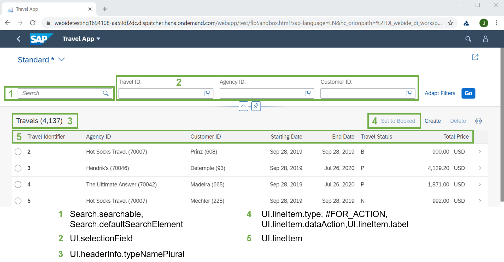
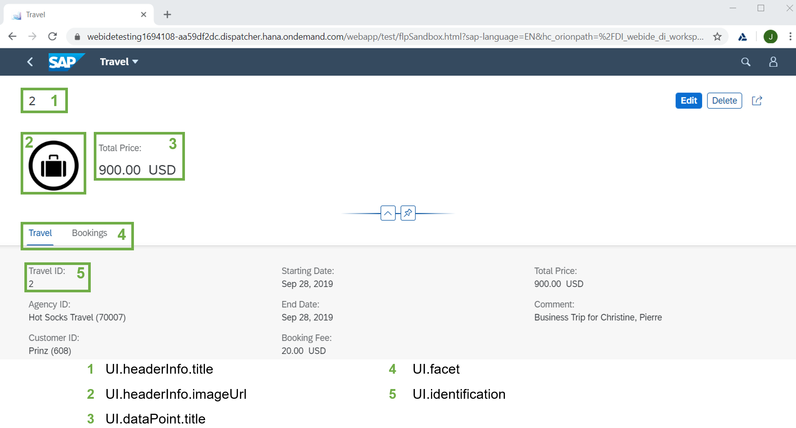

# Part 3d - Creating Metadata Extensions
## Table of Contents
* [Previous: 2. Creating and filling the Database Tables](../part2/README.md)
* [Previous: 3a. Creating the Virtual Data Model (VDM) via ABAP CDS Views](3a.md)  
* [Previous: 3b. Adding master data associations to the VDM](3b.md)
* [Previous: 3c. Projection Views](3c.md) 
* **Current: 3d. Creating Metadata Extensions**  
    * [Requirement](#markdown-header-requirement)  
    * [List Report Annotations](#markdown-header-list-report-annotations)  
    * [Object Page Annotations](#markdown-header-object-page-annotations)  
    * [Introducing Annotation Syntax](#markdown-header-introducing-annotation-syntax)  
    * [Implementation - Travel](#markdown-header-travel)  
    * [Implementation - Booking, BookingSupplement, RoomReservation](#markdown-header-booking)  
    * [Overwriting MDE Annotations via #LAYER](#markdown-header-overwriting-mde-annotations-via-layer)      
* [Next: 3e. Calculating Virtual Elements](3e.md)
* [Next: 4. Behavior Definition & Projection](../part4/4a.md)

## Requirement
[^ Top of page](#)  
As explained previously it is recommended to outsource UI annotations from projection views to metadata extensions in order to build a reusable hierarchy and better-arranged projection views. Therefore we’ll create one MDE for each of our projection views with the same name as the CDS view itself:

* ZRAPH_##_C_TravelWDTP 	
* ZRAPH_##_C_BookingWDTP
* ZRAPH_##_C_BookingSupplWDTP
* ZRAPH_##_C_RoomReservationWDTP

We’ll create those with `@Metadata.layer: #CORE`. This is the lowest level with `#INDUSTRY`, `#PARTNER` and `#CUSTOMER` overwriting it in this order. Every layer can add, remove or modify metadata from lower layers. Remember to add the necessary annotation `@Metadata.allowExtensions: true` in the underlying projection view! For more information, see [Creating Metadata Extensions](https://help.sap.com/viewer/fc4c71aa50014fd1b43721701471913d/201909.001/en-US/fb60be55851e44f086f66c1f3be64a02.html). The Annotation syntax is shown below:

```abap
@Metadata.layer: #layer
annotate entity CDSProjectionView with 
{
    @UI.<annotation_name>: '<annotation_value>'
    element_name;
}
```
## Important UI Annotations  

### List Report Annotations  
[^ Top of page](#)  
The picture below shows the most relevant available UI annotations to use in a SAP Fiori List Report. Those represent only a small fraction of all available UI annotations. These annotations will be reflected in the OData metadata and semantically describe how a specific field should be rendered in the actual application. Fiori Elements will use the UI Annotations to automatically show the app like we describe it in our MDE.  

  

### Object Page Annotations
[^ Top of page](#)  
The picture below shows the most relevant available UI annotations to use in a SAP Fiori Object Page - again only representing a small fraction of all available UI annotations.  

  

### Introducing Annotation Syntax 
[^ Top of page](#)  

#### Header & Facet Configuration

To specify the header texts for Fiori UIs, the annotation `@UI.headerInfo` is used at entity level. It specifies the list title as well as the title for the object page. This annotation is actually defined even before the `annotate entity` statement. You can check the syntax below:  

```abap
@UI: { headerInfo: { typeName: 'Travel',
                     typeNamePlural: 'Travels',
                     title: { type: #STANDARD, value: 'TravelID' } } }
annotate entity CDSProjectionView with 
{ }
```

The main building blocks of the UI are specified as UI facets, basically representing the tabs (see Travel and Bookings in the screenshot above). The annotation `@UI.facet` also enables the navigation to the child entity, which is represented as table in the object page. For example, in the object page annotations in `ZRAPH_##_C_TravelWDTP` we have the Travel instance available with tables to navigate to it’s children Booking and RoomReservation.  

Therefore we'll  have to add the `@UI.facet` annotation later to enable navigation to the child object pages (type: `#LINEITEM_REFERENCE` and provide information for the Travel object page itself (type `#IDENTIFICATION_REFERENCE`). For more information, see [Using Facets to change the Object Page Layout](https://help.sap.com/viewer/fc4c71aa50014fd1b43721701471913d/202009.000/en-US/a7f4d7c6c92b4f929695eeed6e8c38e1.html). The relevant syntax looks as follows:  

```abap
annotate entity CDSProjectionView with 
{
  @UI.facet: [ { id:              '…',
                 label:           '…',
                 position:        <value>,
                 purpose:         #…,
                 targetElement:   '…', 
                 type:            #… } ]
}
```

#### UI Annotations for Fields
[^ Top of page](#)  

The annotations on element level belonging to `@UI.lineItem` are used to define the column position of the element in the tables of the list report and on the object page. In addition, they specify the importance of the element for the list report. If elements are marked with low importance, they are not shown on a device with a narrow screen where limited space is available. The selection fields are defined for the elements that require a filter bar in the UI via `@UI.selectionField`.  

The annotation `@UI.identification` is used to represent an ordered data field collection like e.g. in the General Information section of the object page. This is the syntax of the most important element-specific annotations:  

```abap
@UI: { lineItem:       [ { position: 10,
                           importance: #HIGH } ],
       identification: [ { position: 10 } ],
       selectionField: [ { position: 10 } ] }
```  

 

## Implementation
[^ Top of page](#)  

Enough introductory words - let us begin with creating the metadata extensions!  

We'll create them one after another starting with ZRAPH_##_C_TravelWDTP. For more information on all UI annotations in general, see [UI Annotations](https://help.sap.com/viewer/fc4c71aa50014fd1b43721701471913d/201909.001/en-US/5587d47763184cc48f164648b53c1e4f.html). 

### Travel
[^ Top of page](#)  

#### MDE Creation
Start by right-clicking the identically named CDS Projection View and select _New Metadata Extension_. As discussed above, name the MDE identically to the CDS View `ZRAPH_##_C_TravelWDTP` and select the template `Annotate Entity`.

#### MDE Head Annotations
Next, make sure that the metadata layer is `#CORE`. Then you'll have to add the `@UI.headerInfo` annotation like described above.

#### Facet Annotations
Next we have to provide our facets. For Travel, we need one `type: #IDENTIFICATION_REFERENCE` facet for the travel information itself.  

Next we need one `type: #LINEITEM_REFERENCE` facet for each the `_Booking` and `_RoomReservation` associations. Here we have to add the name of the child association as `targetElement` (like, e.g. `_Booking`).  

#### Field Annotations
Now add all the available fields from the CDS Projection View to the MDE file. Add `UI.lineItem` and `UI.identification` annotations to all relevant fields in order to specify at which position they should be shown in the app.  

Add a `UI.selectionField` annotation to some fields which seem important for filtering to you.  

Finally, hide the technical fields (like e.g. `TravelUUID`, `LastChangedAt`, `LocalLastChangedAt` or `LocalCreatedBy`) with the annotation `@UI.hidden: true`. 

### Booking
[^ Top of page](#)  
Basically, every MDE can be set up in the exact same way like the Travel MDE. For Booking, the difference is that we need only one `type: #LINEITEM_REFERENCE` facet for the `_BookingSupplement` association. Also, please add the annotation `@UI.identification.criticality` for `FlightPrice`, referring to our field `Criticality`.

### BookingSupplement
We don't need a `type: #LINEITEM_REFERENCE` annotation in this case as the Booking Supplement has no further child entities.

### RoomReservation
We don't need a `type: #LINEITEM_REFERENCE` annotation in this case as the Room Reservation has no further child entities.

#### Solutions

* [ZRAPH_##_C_TravelWDTP](sources/Z_C_TravelWDTP_MDE.txt)
* [ZRAPH_##_C_BookingWDTP](sources/Z_C_BookingWDTP_MDE.txt)
* [ZRAPH_##_C_BookingSupplWDTP](sources/Z_C_BookingSupplementWDTP_MDE.txt)
* [ZRAPH_##_C_RoomReservationWDTP](sources/Z_C_RoomReservationWDTP_MDE.txt)

## Overwriting MDE Annotations via #LAYER
[^ Top of page](#)  

To better understand the concept of layering metadata extensions we‘ll create one additional MDE now where we’ll overwrite the label of an existing `@UI.lineItem` for demonstration reasons (see below). Don’t forget to copy the `@UI` annotations for BookingID from the existing `#CORE` MDE as they would be deleted otherwise.  

In order to allow for different layers of extensions, the company developing the basic solution normally uses the `#CORE` layer. Then, they could use a `#LOCALIZATION` layer to change the annotations for a specific language, `#INDUSTRY` layer for differing requirements based on the specific industry which will use the solution. Partner companies can use the `#PARTNER` layer to do some adjustments unique to them or their way of implementation with finally the customer company being able to adjust MDE annotations in the `#CUSTOMER` layer. Layers will get more specific in this order with the latter overwriting annotations from the more general, previously mentioned layers.

Feel free to experiment with other additions or modifications but be sure to use `@Metadata.layer: #CUSTOMER` this time in order to overwrite the annotations we previously created in the `#CORE` layer.  

```abap
@Metadata.layer: #CUSTOMER
annotate entity ZRAPH_##_C_BookingWDTP with
{
  @UI: { lineItem:       [ { position: 20, importance: #HIGH, label: 'Booking Identifier' } ],
         identification: [ { position: 20 } ] }
  BookingID;
}
```

#### Solution
[ZRAPH_##_C_BookingWDTP_CUSTOMER](sources/Z_C_BookingWDTP_MDE_CUSTOMER.txt)

## Next step
[^ Top of page](#)  
[3e. Calculating Virtual Elements](3e.md)
