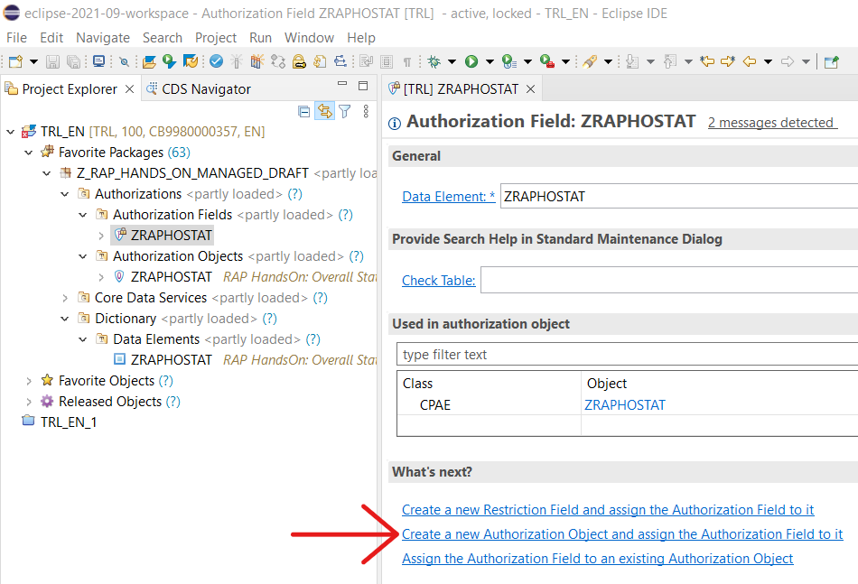

# Part 5b - Implementing Basic Authorizations (optional)

In this optional chapter we will introduce some basic authorizations to our travel scenario. not every user might be allowed to view or do everything in a production environment. Therefor, we'll restrict the shown data based on the `CurrencyCode`. We need an autorization object, authorization field and data element for this and will use the Data Control Language to restrict the data for one of our CDS Views.

### Creating the Data Element
Right-click your ABAP Project in Eclipse and create a new data element named `ZRAPH_##_OSTAT` with a meaningful description like e.g. *RAP HandsOn: Overall Status Authorization*. Select the Domain *Type Name* `/DMO/OVERALL_STATUS`, provide field labels and activate the data element.

### Creating the Authorization Field
Next, we'll create an *Authorization Field* with the name `Z_##_OSTAT` (sadly, authorization field names have a maximum of only 10 characters). After executing the *New...* wizard on your package provide the previously created data element `ZRAPH_##_OSTAT` for the authorization field and save it.

### Creating the Authorization Object
With the authorization field being shown in the Eclipse editor, click on *Create a new Authorization Object and assign the Authorization Field to it*.



In this wizard, again provide `Z_##_OSTAT` as name for you authorization object and choose a meaningful description before finishing. The authorization field table should automatically include your field `Z_##_OSTAT` as well as `ACTVT`. Add the following values to the *Permitted Activities* (if they're not already pre-filled):
* `01` Add or Create
* `02` Change
* `03` Display
* `06` Delete

Now you can save and activate the authorization object, it should look like this:


### Creating a CDS Access Control for ZRAPH_##_I_TravelWDTP
**Using a literal condition**  
Now we want to actually use the created authorization object! To do so we have to define an *Access Control* for our travel interface view using ABAP's data control language. To do so, right-click `ZRAPH_##_I_TravelWDTP` and select *New Access Control*. The name should be the same as the view itself and you can choose a fitting description for the Access Control. When continuing the wizard using *Next >* you'll get to the template selection - choose *Define Role with Simple Conditions* and *Finish*.

In the template, replace the `where` condition to restrict access to travels with `CurrencyCode = 'EUR';` and activate the Access Control afterwards. Now you can try to execute the data preview for the CDS view and will only see entries with euro as currency.

**Using a PFCG condition**  
Next, we'll improve our Access Control to become more sophisticated and actually use the authorization object and field. This will require a `aspect pfcg_auth` condition - PFCG means the profiles generated in SAP systems based on user roles. First, delete the existing where condition in the Access Control and replace it with the following code:
```abap
  ( OverallStatus )                       
    = aspect pfcg_auth ( Z_##_OSTAT, Z_##_OSTAT,  actvt = '03') 
      and
      CurrencyCode = 'EUR'; 
```

Activate the updated access control and run the CDS View Data Preview again. This time you won't see any results at all (because your user doesn't have the necessary PFCG role containing the authorization object + field). In the BTP Trial we cannot assign those roles which is why we can't go into this deeper here - just know that normally this would be how data access is handled for CDS views.

### Inheriting the CDS Access Control in ZRAPH_##_C_TravelWDTP
If you once again try the *Fiori Elements App Preview* like in the previous chapter you'll notice that the access control has no effect there and all travels are shown. That's because the OData services uses the Consumption CDS View and we first have to inherit the access rules from its underlying Interface CDS View.

Right-click your `ZRAPH_##_C_TravelWDTP` and select *New Access Control* - again the name should be the same as the CDS view. This time, select *Define Role with Inherited Conditions* in the template list before clicking *Finish*. Here you basically just have to replace the placeholder `cds_source_entity` before activation. When running the Data Preview of the Consumption View you should again get no results at all. Now, this will also hold true for the App Preview in the Service Binding.

As work-around we'll now again adjust the condition in the underlying Access Controll to `where true;`. This will grant us access to all entries again. Now you've learned, how you would normally handle roles and rights for specific users on which data they are allowed to see and which they aren't.

## Next step
[6. Creating the SAP Fiori List Report app](../part6/README.md)
