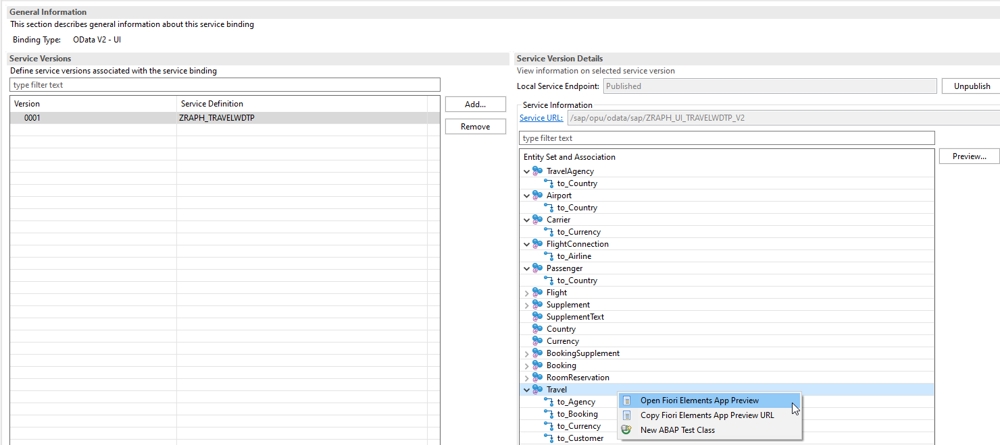

# Readme file for Part 5 - Publishing the Business Service

With our behavior definition and implementation being completed the next step ist to actually publish the CDS views to be exposed via an OData service. This will also allow us to finally test our implementations.

## Service Definition

First, we’ll create the Service Definition and define which CDS entities are exposed as a UI service. Right-click on your project and navigate to New Other ABAP Repository Object > Business Services > Service Definition and define a new one called `ZRAPH_##_TRAVELWDTP`. The Service Definition is used to define which CDS Views are exposed for external usage. This therefore not only includes our Consumption Views for Travel, Booking an BookingSupplement instances but also those used for Value Helps, Navigation and Text Provision. All information on compositions and associations of the exposed CDS views is automatically used. You can see the code below:

```abap
@EndUserText.label: 'RAP HandsOn: Travel Draft Scenario'
define service ZRAPH_##_TRAVELWDTP {
  expose ZRAPH_##_C_TravelWDTP as Travel;
  expose ZRAPH_##_C_BookingWDTP as Booking;
  expose ZRAPH_##_C_BookingSupplementWDTP as BookingSupplement;
  expose ZRAPH_##_C_RoomReservationWDTP as RoomReservation;
  expose /DMO/I_Supplement as Supplement;
  expose /DMO/I_SupplementText as SupplementText;
  expose /DMO/I_Customer as Passenger;
  expose /DMO/I_Agency as TravelAgency;
  expose /DMO/I_Carrier as Carrier;
  expose /DMO/I_Connection as FlightConnection;
  expose /DMO/I_Flight as Flight;
  expose /DMO/I_Airport as Airport;
  expose I_Currency as Currency;
  expose I_Country as Country;
  expose ZRAPH_I_HOTEL as Hotel;
  expose ZRAPH_I_HotelRoomType as HotelRoomType;
  expose ZRAPH_I_OverallStatus as TravelStatus;
  expose ZRAPH_I_OverallStatusText as TravelStatusText;
}
```
For more information see Creating Service Definitions [Service Definitions](https://help.sap.com/viewer/fc4c71aa50014fd1b43721701471913d/202009.000/en-US/ce3133d161ae492698c5b321c74c3274.html).

## Service Binding

Next, we will create the actual OData service. This will be automatically generated by SADL once we create a new Service Binding for Service Definition. Do this by right-clicking the Service Definition and selecting New Service Binding. Provide the Name `ZRAPH_##_UI_TRAVELWDTP_V2` in the wizard, provide a description and select `ODATA V2` – UI as Binding Type before continuing.  
The newly created Service Binding will open without showing too much information. Let’s click `Activate` on the top right. Now the table Entity Set and Association on the right will be filled with all our provided objects and the associations they provide. That’s basically it, the OData service was generated and can be used already.

## Testing the UI service locally

Let’s test the newly created UI Service locally to check whether everything is working.   
The editor of Service Bindings is offering this functionality via running an automatically generated Fiori Elements App based on the OData service.   
To do this: double click the `Travel` EntitySet or select the `Travel` entity and click the `Preview` button or like in the screenshoot right click and select `open fiori elements app preview`. Of course, you can also preview the other entity sets.



This will open a new browser tab prompting you to log into your SAP system again. Once you’ve done that, the Fiori App Preview will load without showing any data, yet. You can already notice the table column’s header “Travel Identifier” which we’ve overwritten in our Metadata Extension previously.

## Next step
[6. Creating the SAP Fiori List Report app](../part6/README.md)
