# Readme file for Part 6 - Creating the SAP Fiori List Report app


## Requirement 
As our FrontEnd team is not able to provide something in time, we will simply create a quick application on our own as this can be achieved pretty easy – even for a BackEnd developer with no UI5 skills. Basically, we want to implement exactly what we’ve just seen in the Fiori App Preview of the Service Binding. This is using the SAP Fiori Elements floorplan “List Report Object Page" which we’ll create ourselves now. 

## Implementation

### Create the SAP Fiori List Report in the FrontEnd
> Before starting creating the SAP Fiori List Report application, make sure that the *Step 6 - Install SAP Business Application Studio* from the [Installation Guide](../installation/Installation.md) is succesfully completed and your SAP Business Application Studio is connected to Cloud Foundry.

As our Service Bindings/OData service is working fine, let’s use it within a SAP Fiori app. As the app doesn’t even exist yet, let’s create (or more precisely generate) it. Therefore, access the SAP Business Application Studio via your browser and from the main screen select the tile *Start from template - Create a new project*:

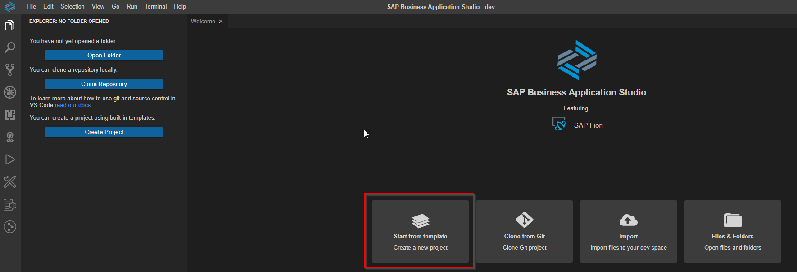

Now choose the *SAP Fiori Application* in the *Select Template and Target Location* step of the Application Wizard provided by SAP Fiori Tools and press *Start*.

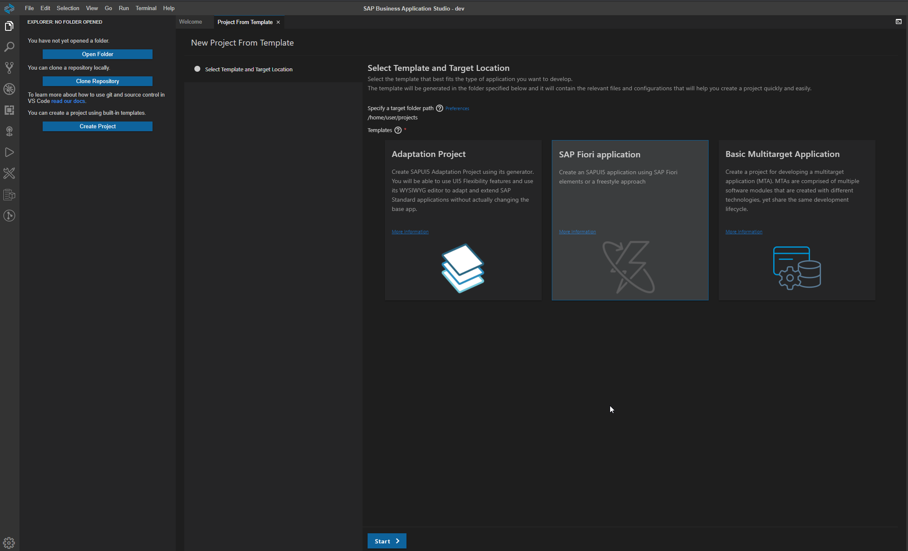

As part of the *Florplan Selection* step, we will pick the *List Report Object Page* floorplan and finally press *Next*.

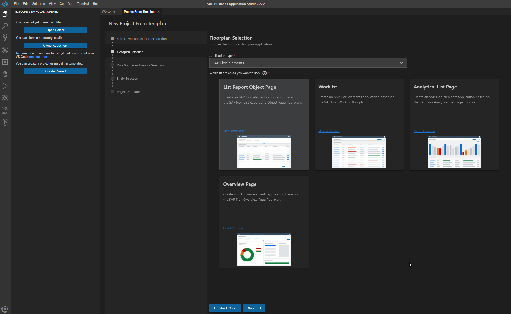

In the next step, the *Data Source* (your SAP BTP ABAP Environment Trial) and *Service* will be selected. The Data Source type in our case will be *Connect to a System*.

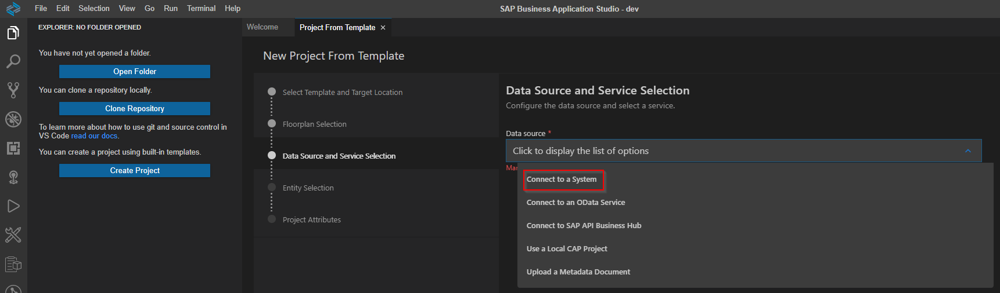

Please provide now your default connection to your SAP BTP ABAP Environment Trial (it follows the naming convention *abap-cloud-default_abap_trial-accountid-space*) and your Service Binding created previously in the part [5. Publishing the Business Service](../part5/README.md) and finally press *Next*.

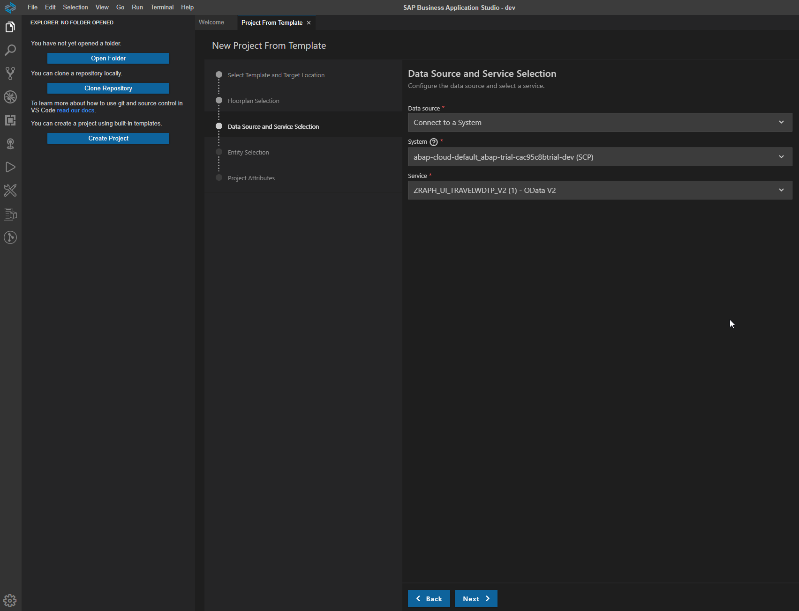

In the *Entity Selection* step, we have to provide as *Main entity* the *Travel* entity and in *Navigation entity* please provide *None* since related navigation from the main entity to the child entities will be provided from backend via UI annotations.

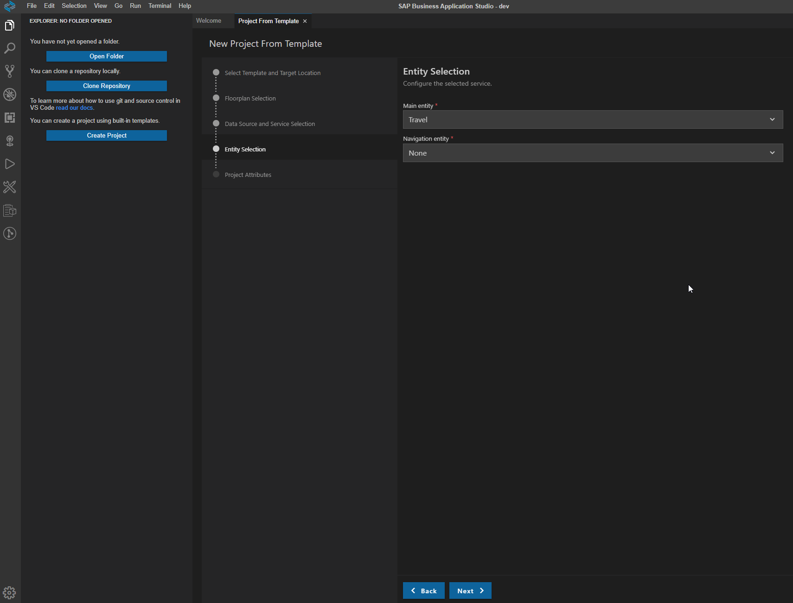

As final step, the project attributes will be provided as follow:

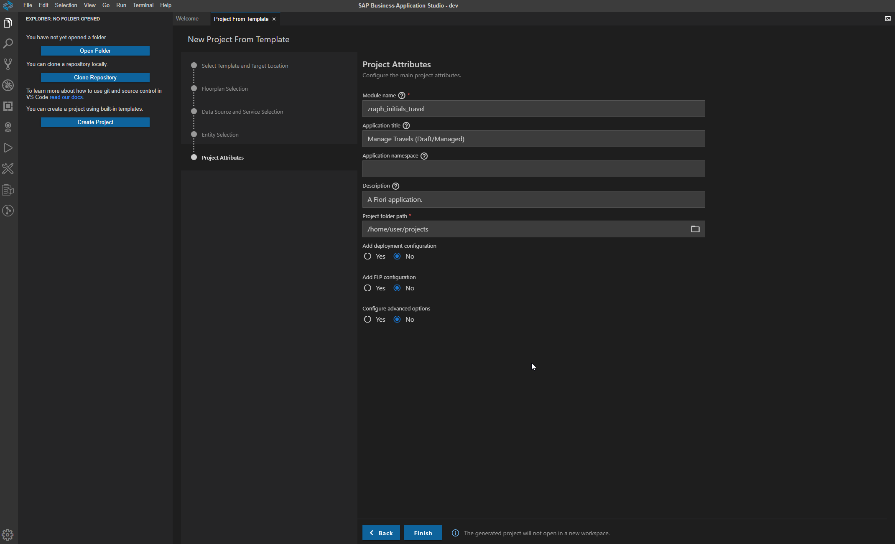

Now press Finish and wait for the magic to happen. After few seconds your first SAP Fiori List Report app was generated and can be opened by using *Open Folder* in SAP Business Application Studio and finally the project will be available as part of a new workspace.

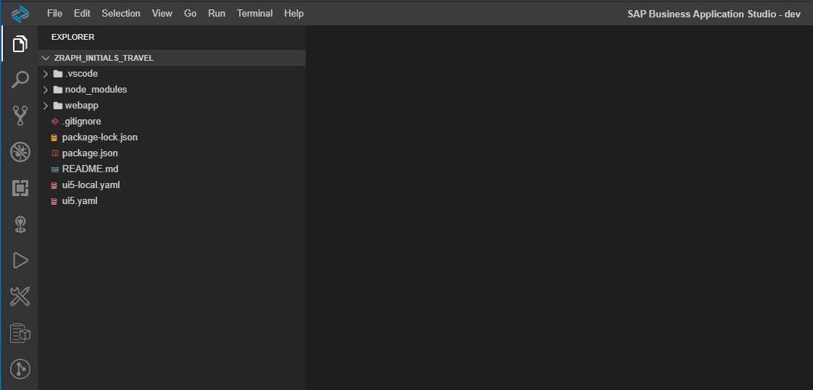

Let's preview the just generated SAP Fiori List report app, by right clicking on the *webapp* folder and using the option *Preview Application*.

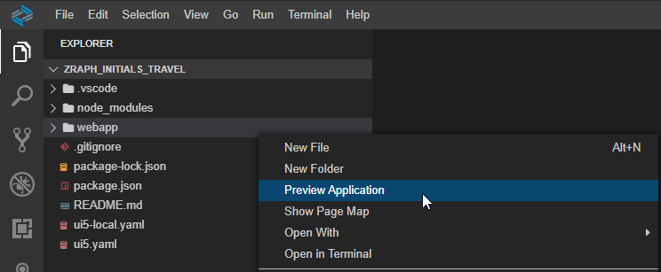

In the appearing pop-up select the npm script *start* and now your freshly created app will start. This may take few minutes until it starts, but finally your app will appear in an additional browser section. You have to know that you have to disable the popup blocker (if necesarry) and preview the app again.

The app is opening and looking exactly as we saw it previously when testing the Service Binding. As we didn’t change any code, this is quite obvious. Anyways we’re e.g. able able to change the selected columns manually by clicking on Settings and selecting them. Those settings allows some out-of-the-box functionality for the user without us having to code anything at all. For example, changing selected fields or arranging their order, sorting, grouping and filtering. 

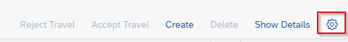

### Defining Object Page Sections for Child Entities
In case that you did not observed, when pressing the *Edit* button on the object page the *Create* button is not available for the child entities and also the navigations from childs of childs are missing. The reason for that is that the in *manifest.json* file the related object page section definitons for the childs were not generated out-of-the-box. Therefore this object page sections will be defined manually by us in this step.

What you have to do, is to replace in *manifest.json* file the following code:

```json
"pages": {
            "ListReport|Travel": {
                "entitySet": "Travel",
                "component": {
                    "name": "sap.suite.ui.generic.template.ListReport",
                    "list": true,
                    "settings": {
                        "condensedTableLayout": true,
                        "smartVariantManagement": true,
                        "enableTableFilterInPageVariant": true,
                        "filterSettings": {
                            "dateSettings": {
                                "useDateRange": true
                            }
                        }
                    }
                },
                "pages": {
                    "ObjectPage|Travel": {
                        "entitySet": "Travel",
                        "defaultLayoutTypeIfExternalNavigation": "MidColumnFullScreen",
                        "component": {
                            "name": "sap.suite.ui.generic.template.ObjectPage"
                        }
                    }
                }
            }
        }
```

with this one where all the related object page sections are defined:

```json
"pages": {
            "ListReport|Travel": {
                "entitySet": "Travel",
                "component": {
                    "name": "sap.suite.ui.generic.template.ListReport",
                    "list": true,
                    "settings": {
                        "condensedTableLayout": true,
                        "smartVariantManagement": true,
                        "enableTableFilterInPageVariant": true,
                        "filterSettings": {
                            "dateSettings": {
                                "useDateRange": true
                            }
                        }
                    }
                },
                "pages": {
                    "ObjectPage|Travel": {
                        "entitySet": "Travel",
                        "defaultLayoutTypeIfExternalNavigation": "MidColumnFullScreen",
                        "component": {
                            "name": "sap.suite.ui.generic.template.ObjectPage",
                            "settings": {
                                "sections": {
                                    "to_Booking::com.sap.vocabularies.UI.v1.LineItem": {},
                                    "to_RoomReservation::com.sap.vocabularies.UI.v1.LineItem": {}                                  
                                }
                            }
                        },
                        "pages": {
                            "ObjectPage|to_Booking": {
                                "navigationProperty": "to_Booking",
                                "entitySet": "Booking",
                                "defaultLayoutTypeIfExternalNavigation": "MidColumnFullScreen",
                                "component": {
                                    "name": "sap.suite.ui.generic.template.ObjectPage"
                                },
                                "pages": {
                                    "ObjectPage|to_BookingSupplement": {
                                        "navigationProperty": "to_BookingSupplement",
                                        "entitySet": "BookingSupplement",
                                        "component": {
                                            "name": "sap.suite.ui.generic.template.ObjectPage"
                                        }
                                    }
                                }
                            },
                            "ObjectPage|to_RoomReservation": {
                                "navigationProperty": "to_RoomReservation",
                                "entitySet": "RoomReservation",
                                "defaultLayoutTypeIfExternalNavigation": "MidColumnFullScreen",
                                "component": {
                                    "name": "sap.suite.ui.generic.template.ObjectPage"
                                }
                            }
                        }
                    }
                }
            }
        }
```

### SAP Fiori Tools
SAP Fiori tools simplifies the development of SAP Fiori elements applications by providing extensions for your SAP Business Application Studio and Visual Studio Code development environment.

The SAP Fiori tools extensions help you create applications, visualize navigation, automatically generate code, and more. Used in combination with SAP Fiori elements, these extensions can increase your development productivity, ensure the consistency of experience between applications, and help you build a scalable experience. 

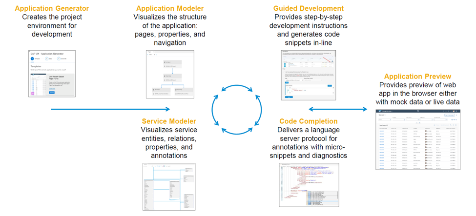

SAP Fiori tools include the following extensions:
1. **Application Wizard/Generator** - a wizard-style approach to generate the provided SAP Fiori elements and SAPUI5 freestyle floorplans. As you may observed, we used already the *Application Wizard* when we generated our SAP Fiori List Report app.
2. **Application Modeler** - access to a visualization of the application pages, navigation, and service entities. You can add new navigation and pages, delete pages, and navigate to corresponding editing tools. The following features are part of this extension - *Page Editor* and *Page Map*.
3. **Guided Development** - access to *How-To* guides and tutorials that explain how to implement certain functionality in an SAP Fiori elements application. You can follow the steps required to implement a feature and then use the guided development approach to make the required changes in your project.
4. **Service Modeler** - visualization of the OData service metadata files. You can use it to browse complex services easily, including entities, properties, and associations.
5. **XML Annotation Language Server** - access to resources that help to define annotations in the code editor, thus improving application development by reducing effort and maintaining code consistency. The following subset of features is part of this extension: Code completion, micro-snippets, diagnostics, internationalization support.

In the followin chapters of this hands-on, you will get yourself more in touch with each and every feature provided by SAP Fiori Tools.

## Solution
The generated SAP Fiori List Application can be found in the following repository - https://bitbucket.org/chiuarucatalin/rap-handson-travel-managed-draft/src/main/

> Please not try to clone/use this repository, since it is configured for an on Premise ABAP frontend server and not for SAP BTP, therefore the next step cannot be done without various manual activities.
## Next step
[7. Deploying your app](../part7/README.md)