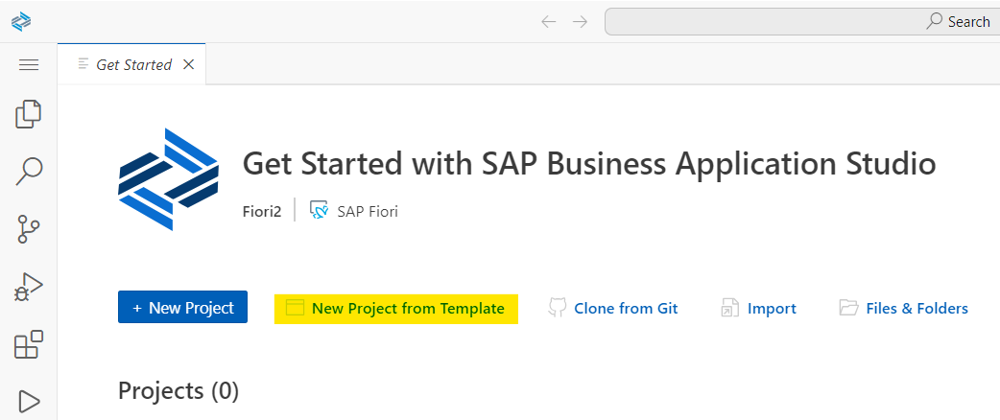
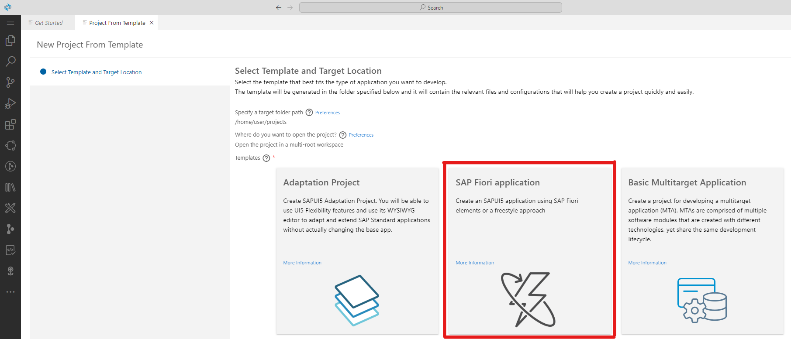
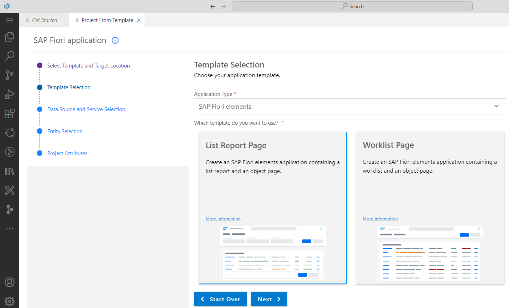
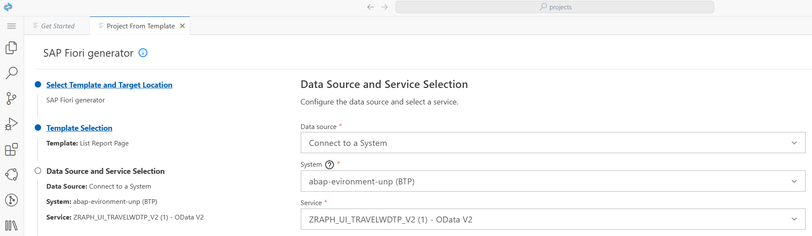
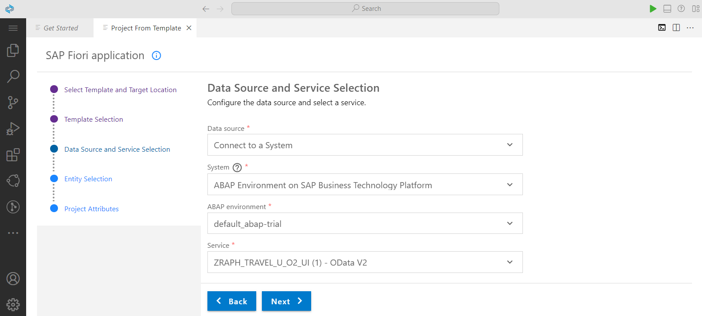
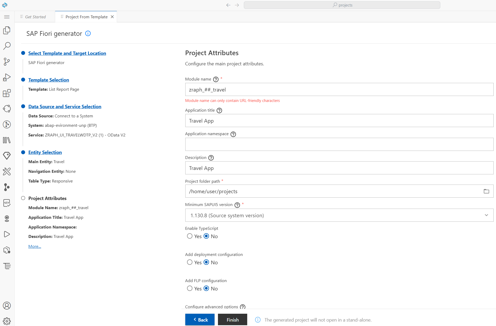
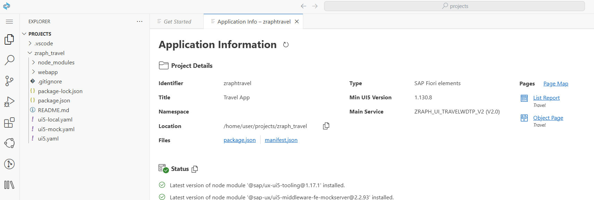
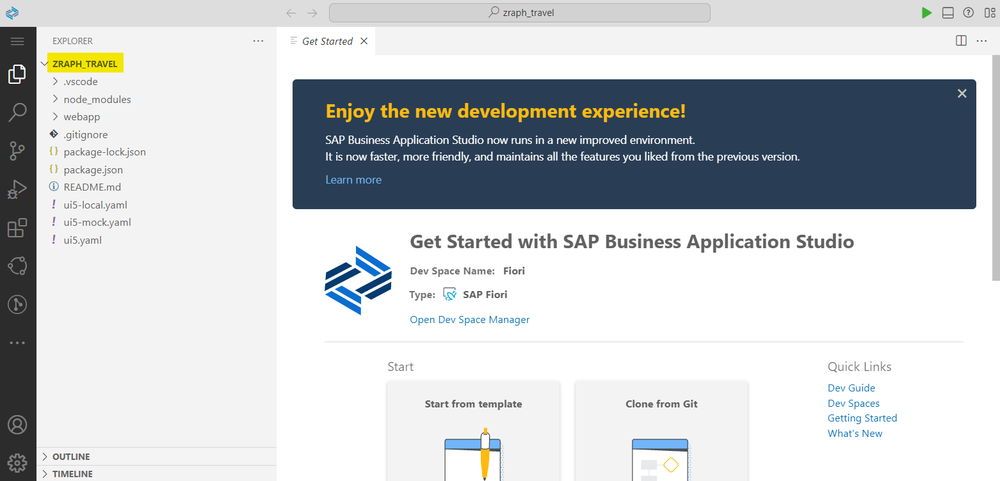
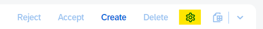

# Part 7b - App Creation
## Table of Contents
* [Previous: 6. Behavior Implementation](../part6/6a.md) / [6. Short Version](../part6/6aSHORT.md)  
* [Previous: 7a. Fiori Tools / BAS Capabilities](7a.md)
* **Current: 7b. Business Application Studio**  
    * [Requirement](#markdown-header-requirement)  
    * [Implementation](#markdown-header-implementation)    
    * [Previewing the app](#markdown-header-previewing-the-app) 
* [Next: 7c. Defining Object Page Sections for Child Entities](7c.md)  
* [Next: 7d. Adding a Side Effect via Guided Development](7d.md)  
* [Next: 8. Deploying our app (optional)](../part8/README.md)  
* [Next: 9. Extending the SAP Fiori List Report](../part9/README.md)

## Requirement
As our FrontEnd team is not able to provide something in time, we will simply create a quick application on our own as this can be achieved pretty easily – even for a BackEnd developer with no UI5 or JavaScript skills. Basically, we want to implement exactly what we’ve just seen in the Fiori App Preview of the Service Binding. This is using the SAP Fiori Elements floorplan “List Report / Object Page" which we’ll create ourselves now. 

## Implementation

### Create the SAP Fiori List Report in the FrontEnd
[^ Top of page](#)  
Before creating the SAP Fiori List Report application, make sure that the *Install SAP Business Application Studio* from the [Installation Guide](../installation/Installation.md) is successfully completed and your SAP Business Application Studio is connected to Cloud Foundry.  

**Important:** As we skipped this installation step prior to the course you'll now have to do _Step 5_ in the [Installation Guide](../installation/Installation.md#markdown-header-5-connecting-bas-with-the-abap-environment).  

**Important:** Seemingly, the SAP Business Application Studio is not running as expected in some browsers, specifically in Mozilla's _Firefox_. Therefore, **please use Google Chrome** (which is recommended by SAP) for all future modifications with the BAS!

As our Service Bindings/OData service is working fine, let’s use it within a SAP Fiori app. As the app doesn’t even exist yet, let’s create (or more precisely generate) it. Therefore, access the SAP Business Application Studio via your browser and from the main screen select the tile *Start from template*:

[^ Top of page](#)  
Now choose the *SAP Fiori Application* in the *Select Template and Target Location* step of the Application Wizard provided by SAP Fiori Tools and press *Start*.

[^ Top of page](#)  
As part of the *Florplan Selection* step, we will pick the *List Report Page* floorplan and finally press *Next*.

[^ Top of page](#)  
In the next step, the *Data source* (Connect to a System), *System* (ABAP Environment on BTP), _ABAP environment_ (msgsystemsag-06-sose-2023-uni-passau-sb-tdd-abap) and *Service* (your personal OData service ZRAPH_##_UI_TRAVELWDTP_V2) will be selected. Provide this information and press *Next*.

[^ Top of page](#)  
In the *Entity Selection* step, we have to provide as *Main entity* the *Travel* entity and in *Navigation entity* please provide *None* since related navigation from the main entity to the child entities will be provided from backend via UI annotations.

[^ Top of page](#)  
As final step, you have to provide a name and some texts for your app. Basically you can choose those on your own but might also use our suggestion:

[^ Top of page](#)  
Now press _Finish_ and wait for the magic to happen. After a few seconds your first SAP Fiori List Report app was generated and can be opened by using *Open folder* in SAP Business Application Studio.  

[^ Top of page](#)  
Finally, the project and all generated files will be available as part of a new workspace in the editor of BAS.

### Previewing the app
[^ Top of page](#)  
Let's preview the just generated SAP Fiori List report app, by right clicking on the *webapp* folder and using the option *Preview Application*. Then, select the `start` option and press enter.

[^ Top of page](#)  
In the appearing pop-up select the first npm script *start*. You'll have to disable the popup blocker (if necessary). Now it'll take a few moments until it starts, but finally your app will appear in an additional browser tab. 

The app is opening and looking exactly as we saw it previously when testing the Service Binding. As we didn’t change any code, this is quite obvious. Anyways we’re e.g. able to change the selected columns manually by clicking on _Settings_ and selecting them. Those settings allows some out-of-the-box functionality for the user without us having to code anything at all. For example, changing selected fields or arranging their order, sorting, grouping and filtering. 

## Next step
[^ Top of page](#)  
[7c. Defining Object Page Sections for Child Entities](7c.md)  
[8. Deploying our app (optional)](../part8/README.md)  
[9. Extending the SAP Fiori List Report](../part9/README.md)