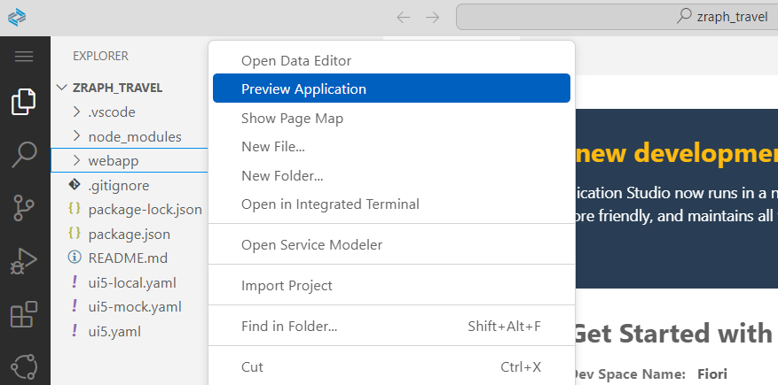
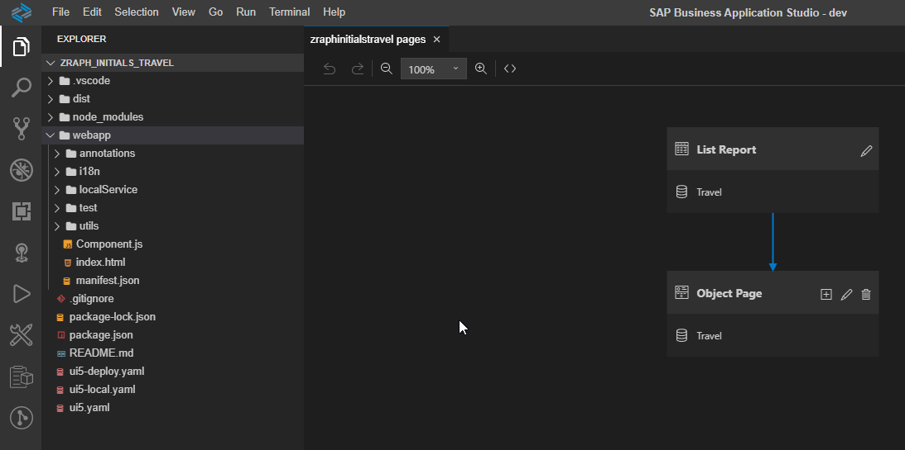
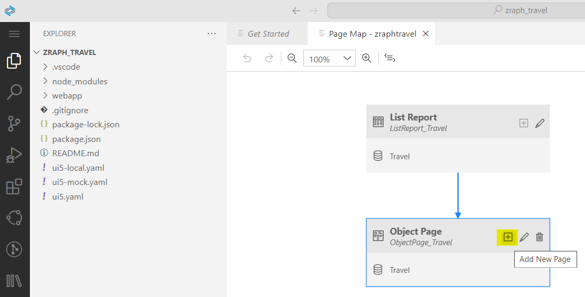
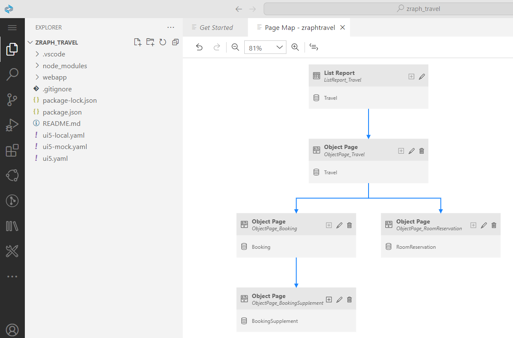

# Part 7b - Defining Object Page Sections for Child Entities

### Defining Object Page Sections for Child Entities
In case that you did not observed, when pressing the *Edit* button on the object page the *Create* button is not available for the child entities and also the navigations from childs of childs are missing. The reason for that is that the in *manifest.json* file the related object page section definitons for the childs were not generated out-of-the-box. Therefore this object page sections will be defined manually by us in this step.

See the current state of the *pages* property in the *manifest.json* file:

```json
"pages": {
            "ListReport|Travel": {
                "entitySet": "Travel",
                "component": {
                    "name": "sap.suite.ui.generic.template.ListReport",
                    "list": true,
                    "settings": {
                        "condensedTableLayout": true,
                        "smartVariantManagement": true,
                        "enableTableFilterInPageVariant": true,
                        "filterSettings": {
                            "dateSettings": {
                                "useDateRange": true
                            }
                        }
                    }
                },
                "pages": {
                    "ObjectPage|Travel": {
                        "entitySet": "Travel",
                        "defaultLayoutTypeIfExternalNavigation": "MidColumnFullScreen",
                        "component": {
                            "name": "sap.suite.ui.generic.template.ObjectPage"
                        }
                    }
                }
            }
        }
```

In order to add the missing object section definitions, we will use the *Page Map* feature which is part of the *Application Modeler* with SAP Fiori Tools. In case that you do not remember the concrete relationships between the entities, check the diagram below:


From your SAP Fiori List Report repo in SAP Business Application Studio, right click on the *webapp* folder and press *Show Page Map*.



After performing the previous step, you will get an overview of the already existing pages, i.e. the *List Report* and the *Object Page* pages which points out both to the *Travel* entity. 



From the Travel Object Page we will add a new *Object Page* section to *Booking* entity according to the above diagram. Please press the *+* button on the related Travel Object Page and select the *to_Booking* as navigation property which points out to the navigation Travel>Booking and finally in the appearing pop-up please press *Add*.



The same activities need to be performed for all the missing object page sections.

The *Page Map* diagram will look like above after defining all missing object page sections:



Also, now you can check the `manifest.json` file again and will see, that those new object pages have been generated and added here as well (in comparison to the code snippet from above):

```json
"pages": {
    "ObjectPage|Travel": {
        "entitySet": "Travel",
        "defaultLayoutTypeIfExternalNavigation": "MidColumnFullScreen",
        "component": {
            "name": "sap.suite.ui.generic.template.ObjectPage",
            "settings": {
                "sections": {
                    "to_Booking::com.sap.vocabularies.UI.v1.LineItem": {},
                    "to_RoomReservation::com.sap.vocabularies.UI.v1.LineItem": {}                                  
                }
            }
        },
        "pages": {
            "ObjectPage|to_Booking": {
                "navigationProperty": "to_Booking",
                "entitySet": "Booking",
                "defaultLayoutTypeIfExternalNavigation": "MidColumnFullScreen",
                "component": {
                    "name": "sap.suite.ui.generic.template.ObjectPage"
                },
                "pages": {
                    "ObjectPage|to_BookingSupplement": {
                        "navigationProperty": "to_BookingSupplement",
                        "entitySet": "BookingSupplement",
                        "component": {
                            "name": "sap.suite.ui.generic.template.ObjectPage"
                        }
                    }
                }
            },
            "ObjectPage|to_RoomReservation": {
                "navigationProperty": "to_RoomReservation",
                "entitySet": "RoomReservation",
                "defaultLayoutTypeIfExternalNavigation": "MidColumnFullScreen",
                "component": {
                    "name": "sap.suite.ui.generic.template.ObjectPage"
                }
            }
        }
    }
}
```

If you preview now the app again, you will see that the *Create* button is available for each and every section and all the navigations are working properly. **That's it! Congrats! :)**


## Solution
The generated SAP Fiori List Application can be found in the following repository - https://bitbucket.org/chiuarucatalin/rap-handson-travel-managed-draft/src/main/

> Please not try to clone/use this repository, since it is configured for an on Premise ABAP frontend server and not for SAP BTP, therefore the next step cannot be done without various manual activities. You can simply use it to check the code for different files in case it is needed and compare with yours.


## Optional
[7c. Adding a Side Effect via Guided Development](7c.md)  
[8. Deploying your app](../part8/README.md)

## Next step
[9. Extending the SAP Fiori List Report](../part9/README.md)