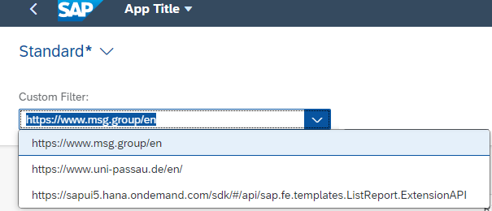
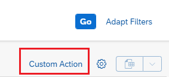
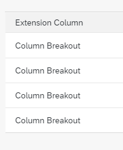
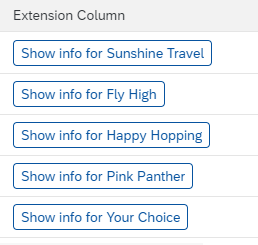
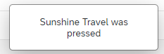
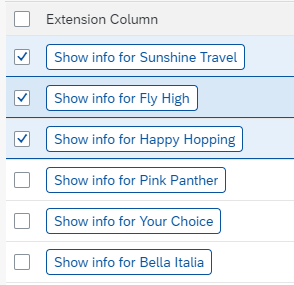
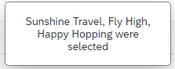

# Readme file for Part 8 - Extending the SAP Fiori List Report

## Requirement
We want to add the absolutely useful function to open 3 predefined web pages by selecting them in a dropdown box and pressing a button.  
For this, we will need to implement 2 extensions to the list report, one filter and one action.  
This is covered in section 1 and 2.  
  
Then we also want to add a new column to the list report, which contains a button that tells us the agency name of the current line.  
This is covered in secion 3.  
  
At last we want a selection dependent multi select action that tells us which agencies are in the selected rows.  
This is covered in section 4.  
  
## 1. Add the custom filter

Open the guided development by pressing CTRL+SHIFT+P and choose "Fiori: Open Guided Development" or right click on the project and select the item "SAP Fiori tools - Open Guided Development.  
  
Select item "Add a custom filter to the filter bar".  
Press "Start Guide".  
In the wizard select/enter the following information:  

| Field              | Value         |
| ------------------ | ------------- |
| Fragment File Name | CustomFilter  |
| Custom Filter key  | customFilter  |
| Custom Filter name | Custom Filter |
| Control ID         | customFilter  |
  
Press "Insert Snippet".  
Press "Next".  
Press "Next" again to skip step 2.  
  
In the next step enter the following information:  

| Field      | Value   |
| ---------- | ------- |
| Entity Set | Travel  |
  
Press "Insert Snippet".  
Press "Exit Guide".  
  
In webapp/ext/fragments find the file CustomFilter.fragment.xml.  
Change the texts of the the 3 items within the ComboBox to 3 non-suspicious web pages.  
Example:  

| Item key | Item text                                                                           |
| -------- | ----------------------------------------------------------------------------------- |
| 0        | https://www.msg.group/en                                                            |
| 1        | https://www.uni-passau.de/en/                                                       |
| 2        | https://sapui5.hana.ondemand.com/sdk/#/api/sap.fe.templates.ListReport.ExtensionAPI |
  
Test the app and see the new filter "Custom Filter" that looks like this:  

  
[Solution](solutions/CustomFilter.fragment.xml)  
  
## 2. Add custom action

Select item "Add a custom action to a page using extension".  
Press "Start Guide".  
In the wizard select/enter the following information:  

| Field         | Value                    |
| ------------- | ------------------------ |
| Page          | List Report Page         |
| Function Name | onExtensionButtonPressed |
  
Press "Insert Snippet".  
Press "Next".  
  
In the next step select/enter the following information:  

| Field           | Value         |
| --------------- | ------------- |
| Entity Set      | Travel        |
| Action Position | Table Toolbar |
| Action ID       | customAction  |
| Button Text     | Custom Action |
| Row Selection   | no            |
  
Press "Insert Snippet".  
Press "Exit Guide".  
  
### Test the App
Find the new button in the toolbar:  

  
If you press on it, just a pop up appears with "onExtensionButtonPressed".  
This is the generated default behaviour and will be overwritten in the next step.  
  
### Add own coding to open an external web page
Find the generated controller "ListReportExt.controller.js" in webapp/ext/controller.  
Within this file, the function "onExtensionButtonPressed" exists, which we will now change.  

Replace the functions content with:  
```js
var sExternalPage = this.getView().byId("customFilter").getValue();
window.open(sExternalPage);
```
  
Again test the button. Now the selected web page is opened (or an empty tab/window if nothing is selected).  
  
[Solution](solutions/ListReportExt.controller-1.js)  
  
## 3. Add a custom column to the table

### Add basic column

Start the guide "Add custom columns to the table using extensions".  
In the wizard select/enter the following information:  

| Field            | Value      |
| ---------------- | ---------- |
| Table Type       | Responsive |
| Entity Type      | TravelType |
| Leading Property | AgencyName |
  
Press "Insert Snippet".  
Press "Next".  
  
In this step we don't have any input to give.  
  
Press "Insert Snippet".  
Press "Next".  
  
In this step, enter the following information:  

| Field      | Value       |
| ---------- | ----------- |
| Page Type  | List Report |
| Entity Set | Travel      |
  
Press "Insert Snippet".  
Press "Exit Guide".  
  
Check the app. Select data to see the custom cells.  
It should look sort of like this:  
  
  
### Give some life to the costum column
  
#### Make the button text context dependent
Find ResponsiveTableCells.fragment.xml in webapp/ext/fragments.  
We want to include the name of the hotel in the button text and handle the press on it later.  
Replace the Text control with a button control with the following properties:  

| Property | Value                        |
| -------- | ---------------------------- |
| text     | Show info for `{AgencyName}` |
| press    | onRowButtonPressed           |
  
Check the app. Select data to see the custom cells.  
It should now look sort of like this:  
  
  
[Solution](solutions/ResponsiveTableCells.fragment.xml)  

#### Handle the button press
In the previous step we already told the framework to call a function called "onRowButtonPressed", when the button is pressed.  
However we did not yet define that function.  
So now we open webapp/ext/controller/ListReportExt.controller.js and add the following function definition:  

```js
onRowButtonPressed: function(oEvent) {
    var sAgencyName = oEvent.getSource().getBindingContext().getProperty("AgencyName");
    sap.m.MessageToast.show(sAgencyName + " was pressed");
}
```
  
When the button is now pressed, the result should look like this:  
  
  
[Solution](solutions/ListReportExt.controller-2.js)  
  
## 4. Let us use the extensionAPI for once

### Add another custom action

Select item "Add a custom action to a page using extension".  
Press "Start Guide".  
In the wizard select/enter the following information:  

| Field         | Value                     |
| ------------- | ------------------------- |
| Page          | List Report Page          |
| Function Name | onExtensionButton2Pressed |
  
Press "Insert Snippet".  
Press "Next".  
  
In the next step select/enter the following information:  

| Field           | Value             |
| --------------- | ----------------- |
| Entity Set      | Travel            |
| Action Position | Table Toolbar     |
| Action ID       | customAction2     |
| Button Text     | What is selected? |
| Row Selection   | yes               |
  
Press "Insert Snippet".  
Press "Exit Guide".  
  
### Adapt the coding
  
In webapp/ext/controller/ListReportExt.controller.js find function onExtensionButton2Pressed.  
Adapt it to show a message toast with the text "`<AgencyNames>` were selected", where `<AgencyName>` should be replaced with the comma separated list of selected agencies.  

Within the function you can access the extension API using:  
```js
this.extensionAPI
```
Here is a helpful resource as how to get the selected contexts:  
[ExtensionAPI](https://sapui5.hana.ondemand.com/sdk/#/api/sap.suite.ui.generic.template.ListReport.extensionAPI.ExtensionAPI%23methods/getSelectedContexts)  
Call this method and assign the result to a variable aSelection:  
```js
var aSelection = // insert your code to determine the selected contexts here
```
  
A selected context can access the data of the corresponding line using the getProperty method as already done in onRowButtonPressed.  
  
To concatenate the values of the resulting array, the reduce method can be used:    
[Array.reduce](https://www.w3schools.com/jsref/jsref_reduce.asp)  
This method takes a function as first and an initial value as second parameter.  
The function to be given as first parameter can be declared an passed as follows.  
```js
var fnReduction = function(sValue, oContext) {
    var sCurrentValue = // insert your code to determine the Agency name out of the context oContext here
    if(sValue.length === 0) {
        return sCurrentValue;
    } else {
        return sValue + ", " + sCurrentValue;
    }
};
var sMessageText = aSelection.reduce(fnReduction, "") + " were selected";
```
  
[Solution](solutions/ListReportExt.controller-3.js)  
  
### Activate multiselect
Open the guided development item "Enable multiple selection in tables".  
As Page, choose the ListReport.  
  
Press "Insert Snippet".  
Press "Exit Guide".  
  
[Solution manifest.json](solutions/manifest.json)  

### Test the app
It should now look like this:  


  